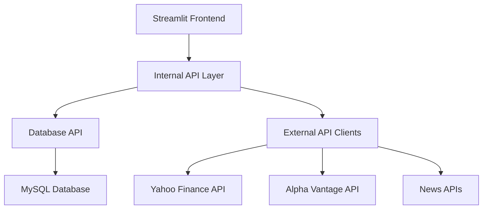

# Stock Market Analytics Platform - API Documentation

This document provides comprehensive API documentation for the Stock Market Analytics Platform's internal APIs and external integrations.

## 📋 Table of Contents

- [Overview](#overview)
- [Internal API Endpoints](#internal-api-endpoints)
- [Database API](#database-api)
- [External API Integrations](#external-api-integrations)
- [Data Models](#data-models)
- [Authentication](#authentication)
- [Error Handling](#error-handling)
- [Rate Limiting](#rate-limiting)
- [Examples](#examples)

## 🔍 Overview

The Stock Market Analytics Platform provides both internal APIs for component communication and external API integrations for data sourcing.

### API Architecture



### Base Configuration

| Component | Base URL | Protocol |
|-----------|----------|----------|
| **Internal API** | `http://localhost:8501` | HTTP |
| **Database API** | Local SQLAlchemy | ORM |
| **Yahoo Finance** | `https://query1.finance.yahoo.com` | HTTPS |
| **Alpha Vantage** | `https://www.alphavantage.co` | HTTPS |

## 🔌 Internal API Endpoints

### Stock Data Endpoints

#### Get Stock Information

```http
GET /api/stocks/{symbol}
```

**Parameters:**

| Parameter | Type | Required | Description |
|-----------|------|----------|-------------|
| `symbol` | string | Yes | Stock symbol (e.g., "RELIANCE.NS") |

**Response:**

```json
{
    "status": "success",
    "data": {
        "id": 1,
        "symbol": "RELIANCE.NS",
        "company_name": "Reliance Industries Limited",
        "sector": "Energy",
        "market_cap": 1750000.00,
        "last_updated": "2024-08-09T10:30:00Z"
    }
}
```

#### Get Historical Prices

```http
GET /api/stocks/{symbol}/prices
```

**Query Parameters:**

| Parameter | Type | Required | Default | Description |
|-----------|------|----------|---------|-------------|
| `start_date` | date | No | 30 days ago | Start date (YYYY-MM-DD) |
| `end_date` | date | No | Today | End date (YYYY-MM-DD) |
| `interval` | string | No | "1d" | Data interval (1d, 1wk, 1mo) |
| `limit` | integer | No | 100 | Maximum records to return |

**Response:**

```json
{
    "status": "success",
    "data": {
        "symbol": "RELIANCE.NS",
        "prices": [
            {
                "date": "2024-08-09",
                "open": 2450.50,
                "high": 2475.30,
                "low": 2440.20,
                "close": 2460.75,
                "adj_close": 2460.75,
                "volume": 1250000
            }
        ],
        "count": 1,
        "total_pages": 1
    }
}
```

#### Get Technical Indicators

```http
GET /api/stocks/{symbol}/indicators
```

**Query Parameters:**

| Parameter | Type | Required | Default | Description |
|-----------|------|----------|---------|-------------|
| `indicators` | string | No | "sma_20" | Comma-separated indicator list |
| `period` | integer | No | 30 | Number of days |
| `date` | date | No | Today | Specific date |

**Available Indicators:**

| Indicator | Description | Parameters |
|-----------|-------------|------------|
| `sma_20` | 20-day Simple Moving Average | period |
| `sma_50` | 50-day Simple Moving Average | period |
| `sma_200` | 200-day Simple Moving Average | period |
| `ema_12` | 12-day Exponential Moving Average | period |
| `ema_26` | 26-day Exponential Moving Average | period |
| `rsi` | Relative Strength Index | period (default: 14) |
| `macd` | MACD Line | fast=12, slow=26, signal=9 |
| `bollinger` | Bollinger Bands | period=20, std=2 |

**Response:**

```json
{
    "status": "success",
    "data": {
        "symbol": "RELIANCE.NS",
        "indicators": {
            "sma_20": 2455.30,
            "rsi": 65.4,
            "macd": 12.5,
            "bollinger_upper": 2490.50,
            "bollinger_lower": 2420.10
        },
        "date": "2024-08-09"
    }
}
```

### Market Analysis Endpoints

#### Get Top Gainers/Losers

```http
GET /api/market/movers
```

**Query Parameters:**

| Parameter | Type | Required | Default | Description |
|-----------|------|----------|---------|-------------|
| `type` | string | No | "gainers" | "gainers" or "losers" |
| `timeframe` | string | No | "1d" | "1d", "1w", "1m" |
| `limit` | integer | No | 5 | Number of results |
| `sector` | string | No | null | Filter by sector |

**Response:**

```json
{
    "status": "success",
    "data": {
        "type": "gainers",
        "timeframe": "1d",
        "stocks": [
            {
                "symbol": "TECHM.NS",
                "company_name": "Tech Mahindra Limited",
                "current_price": 1250.75,
                "change": 85.30,
                "change_percent": 7.32,
                "volume": 2500000,
                "sector": "IT"
            }
        ],
        "generated_at": "2024-08-09T15:30:00Z"
    }
}
```

#### Get Market Summary

```http
GET /api/market/summary
```

**Response:**

```json
{
    "status": "success",
    "data": {
        "indices": [
            {
                "name": "NIFTY 50",
                "value": 19850.45,
                "change": 125.30,
                "change_percent": 0.63,
                "volume": 1500000000
            },
            {
                "name": "SENSEX",
                "value": 66750.20,
                "change": 420.15,
                "change_percent": 0.63,
                "volume": 2800000000
            }
        ],
        "market_status": "OPEN",
        "last_updated": "2024-08-09T15:30:00Z"
    }
}
```

### Watchlist Endpoints

#### Get All Watchlists

```http
GET /api/watchlists
```

**Response:**

```json
{
    "status": "success",
    "data": [
        {
            "id": 1,
            "name": "My Portfolio",
            "description": "Personal investment portfolio",
            "stock_count": 12,
            "created_at": "2024-07-01T10:00:00Z",
            "is_default": true
        }
    ]
}
```

#### Create Watchlist

```http
POST /api/watchlists
```

**Request Body:**

```json
{
    "name": "Tech Stocks",
    "description": "Technology sector watchlist",
    "stocks": ["TCS.NS", "INFY.NS", "HCLTECH.NS"]
}
```

**Response:**

```json
{
    "status": "success",
    "data": {
        "id": 2,
        "name": "Tech Stocks",
        "description": "Technology sector watchlist",
        "stock_count": 3,
        "created_at": "2024-08-09T16:00:00Z"
    }
}
```

#### Get Watchlist Details

```http
GET /api/watchlists/{watchlist_id}
```

**Response:**

```json
{
    "status": "success",
    "data": {
        "id": 1,
        "name": "My Portfolio",
        "description": "Personal investment portfolio",
        "stocks": [
            {
                "symbol": "RELIANCE.NS",
                "company_name": "Reliance Industries Limited",
                "current_price": 2460.75,
                "change": 15.25,
                "change_percent": 0.62,
                "added_at": "2024-07-01T10:00:00Z"
            }
        ],
        "performance": {
            "total_value": 125000.50,
            "total_change": 2500.30,
            "total_change_percent": 2.04
        }
    }
}
```

#### Add Stock to Watchlist

```http
POST /api/watchlists/{watchlist_id}/stocks
```

**Request Body:**

```json
{
    "symbol": "HDFC.NS"
}
```

#### Remove Stock from Watchlist

```http
DELETE /api/watchlists/{watchlist_id}/stocks/{symbol}
```

### News Endpoints

#### Get Stock News

```http
GET /api/news/stocks/{symbol}
```

**Query Parameters:**

| Parameter | Type | Required | Default | Description |
|-----------|------|----------|---------|-------------|
| `limit` | integer | No | 10 | Number of articles |
| `days` | integer | No | 7 | Days to look back |
| `language` | string | No | "en" | Language code |

**Response:**

```json
{
    "status": "success",
    "data": {
        "symbol": "RELIANCE.NS",
        "articles": [
            {
                "title": "Reliance Industries announces quarterly results",
                "summary": "Strong performance across all business segments",
                "url": "https://example.com/news/article1",
                "published_at": "2024-08-09T14:00:00Z",
                "source": "Economic Times",
                "sentiment": "positive"
            }
        ],
        "total": 25
    }
}
```

#### Get Market News

```http
GET /api/news/market
```

**Query Parameters:**

| Parameter | Type | Required | Default | Description |
|-----------|------|----------|---------|-------------|
| `category` | string | No | "general" | News category |
| `limit` | integer | No | 20 | Number of articles |

**Response:**

```json
{
    "status": "success",
    "data": {
        "articles": [
            {
                "title": "Indian markets surge on positive global cues",
                "summary": "Nifty and Sensex both gain over 1%",
                "url": "https://example.com/news/market1",
                "published_at": "2024-08-09T13:30:00Z",
                "source": "Business Standard",
                "category": "market"
            }
        ],
        "total": 45
    }
}
```

## 🗄️ Database API

### Connection Management

```python
from data.database import DatabaseManager

# Initialize database manager
db = DatabaseManager()

# Get database session
with db.get_session() as session:
    # Perform database operations
    stocks = session.query(Stock).all()
```

### Model Operations

#### Stock Operations

```python
from data.database import Stock, StockPrice

# Create new stock
new_stock = Stock(
    symbol="NEWSTOCK.NS",
    company_name="New Company Ltd",
    sector="Technology"
)
session.add(new_stock)
session.commit()

# Query stocks
stocks = session.query(Stock).filter(
    Stock.sector == "Technology"
).limit(10).all()

# Update stock
stock = session.query(Stock).filter(
    Stock.symbol == "RELIANCE.NS"
).first()
stock.market_cap = 1800000.00
session.commit()
```

#### Price Data Operations

```python
# Bulk insert prices
price_data = [
    {
        "stock_id": 1,
        "date": "2024-08-09",
        "open": 2450.50,
        "high": 2475.30,
        "low": 2440.20,
        "close": 2460.75,
        "volume": 1250000
    }
]

session.bulk_insert_mappings(StockPrice, price_data)
session.commit()

# Query price data
prices = session.query(StockPrice).join(Stock).filter(
    Stock.symbol == "RELIANCE.NS",
    StockPrice.date >= "2024-07-01"
).order_by(StockPrice.date.desc()).limit(30).all()
```

#### Technical Indicator Operations

```python
from data.database import TechnicalIndicator

# Insert technical indicators
indicators = TechnicalIndicator(
    stock_id=1,
    date="2024-08-09",
    sma_20=2455.30,
    sma_50=2430.75,
    rsi=65.4,
    macd=12.5
)
session.add(indicators)
session.commit()

# Query indicators with date range
indicators = session.query(TechnicalIndicator).filter(
    TechnicalIndicator.stock_id == 1,
    TechnicalIndicator.date >= "2024-07-01"
).all()
```

#### Watchlist Operations

```python
from data.database import Watchlist, WatchlistStock

# Create watchlist
watchlist = Watchlist(
    name="Tech Stocks",
    description="Technology sector investments"
)
session.add(watchlist)
session.commit()

# Add stocks to watchlist
watchlist_stocks = [
    WatchlistStock(watchlist_id=watchlist.id, stock_id=1),
    WatchlistStock(watchlist_id=watchlist.id, stock_id=2)
]
session.add_all(watchlist_stocks)
session.commit()

# Query watchlist with stocks
watchlist_data = session.query(Watchlist).join(
    WatchlistStock
).join(Stock).filter(
    Watchlist.id == 1
).all()
```

## 🌐 External API Integrations

### Yahoo Finance API

#### Configuration

```python
import yfinance as yf
from typing import Dict, List, Optional

class YahooFinanceClient:
    """Client for Yahoo Finance API integration."""
    
    def __init__(self):
        self.base_url = "https://query1.finance.yahoo.com"
        self.session = requests.Session()
```

#### Available Methods

| Method | Description | Parameters | Return Type |
|--------|-------------|------------|-------------|
| `get_stock_info()` | Basic stock information | symbol | Dict |
| `get_historical_data()` | Historical price data | symbol, period, interval | DataFrame |
| `get_real_time_price()` | Current stock price | symbol | Dict |
| `get_multiple_quotes()` | Multiple stock quotes | symbols | List[Dict] |

#### Usage Examples

```python
# Initialize client
yahoo_client = YahooFinanceClient()

# Get stock information
stock_info = yahoo_client.get_stock_info("RELIANCE.NS")
# Returns: {
#     "symbol": "RELIANCE.NS",
#     "longName": "Reliance Industries Limited",
#     "sector": "Energy",
#     "marketCap": 1750000000000,
#     "currentPrice": 2460.75
# }

# Get historical data
historical_data = yahoo_client.get_historical_data(
    symbol="RELIANCE.NS",
    period="1y",
    interval="1d"
)
# Returns: pandas DataFrame with OHLCV data

# Get real-time price
current_price = yahoo_client.get_real_time_price("RELIANCE.NS")
# Returns: {
#     "symbol": "RELIANCE.NS",
#     "price": 2460.75,
#     "change": 15.25,
#     "changePercent": 0.62,
#     "timestamp": "2024-08-09T15:30:00Z"
# }

# Get multiple quotes
quotes = yahoo_client.get_multiple_quotes([
    "RELIANCE.NS", "TCS.NS", "INFY.NS"
])
```

#### Error Handling

```python
from requests.exceptions import RequestException, Timeout
from utils.exceptions import APIError, RateLimitError

def get_stock_data_with_retry(symbol: str, max_retries: int = 3):
    """Get stock data with retry logic."""
    
    for attempt in range(max_retries):
        try:
            return yahoo_client.get_stock_info(symbol)
            
        except Timeout:
            if attempt == max_retries - 1:
                raise APIError(f"Timeout fetching data for {symbol}")
            time.sleep(2 ** attempt)  # Exponential backoff
            
        except RequestException as e:
            if "429" in str(e):  # Rate limit
                raise RateLimitError("Yahoo Finance rate limit exceeded")
            raise APIError(f"API error for {symbol}: {str(e)}")
```

### Alpha Vantage API

#### Configuration

```python
class AlphaVantageClient:
    """Client for Alpha Vantage API integration."""
    
    def __init__(self, api_key: str):
        self.api_key = api_key
        self.base_url = "https://www.alphavantage.co/query"
        self.rate_limit = 5  # calls per minute
```

#### Available Functions

| Function | API Function | Description | Parameters |
|----------|-------------|-------------|------------|
| `get_daily_data()` | TIME_SERIES_DAILY | Daily time series | symbol, outputsize |
| `get_weekly_data()` | TIME_SERIES_WEEKLY | Weekly time series | symbol |
| `get_monthly_data()` | TIME_SERIES_MONTHLY | Monthly time series | symbol |
| `get_intraday_data()` | TIME_SERIES_INTRADAY | Intraday time series | symbol, interval |
| `get_technical_indicators()` | Technical Indicators | RSI, MACD, etc. | symbol, indicator, params |

#### Usage Examples

```python
# Initialize with API key
alpha_client = AlphaVantageClient(api_key="YOUR_API_KEY")

# Get daily data
daily_data = alpha_client.get_daily_data(
    symbol="RELIANCE.NS",
    outputsize="compact"  # or "full"
)

# Get technical indicators
rsi_data = alpha_client.get_technical_indicators(
    symbol="RELIANCE.NS",
    indicator="RSI",
    interval="daily",
    time_period=14
)

# Get intraday data
intraday_data = alpha_client.get_intraday_data(
    symbol="RELIANCE.NS",
    interval="5min"
)
```

#### Rate Limiting

```python
import time
from functools import wraps

def rate_limit(max_calls: int = 5, time_window: int = 60):
    """Decorator for rate limiting API calls."""
    calls = []
    
    def decorator(func):
        @wraps(func)
        def wrapper(*args, **kwargs):
            now = time.time()
            # Remove old calls outside time window
            calls[:] = [call_time for call_time in calls if now - call_time < time_window]
            
            if len(calls) >= max_calls:
                sleep_time = time_window - (now - calls[0])
                time.sleep(sleep_time)
                calls.pop(0)
            
            calls.append(now)
            return func(*args, **kwargs)
        return wrapper
    return decorator

class AlphaVantageClient:
    @rate_limit(max_calls=5, time_window=60)
    def get_daily_data(self, symbol: str):
        # API call implementation
        pass
```

### News API Integration

#### Configuration

```python
class NewsAPIClient:
    """Client for news API integration."""
    
    def __init__(self, api_key: str):
        self.api_key = api_key
        self.base_url = "https://newsapi.org/v2"
```

#### Available Endpoints

| Endpoint | Description | Parameters | Use Case |
|----------|-------------|------------|----------|
| `/everything` | Search articles | q, sources, language, sortBy | Stock-specific news |
| `/top-headlines` | Top headlines | country, category, sources | Market news |
| `/sources` | Available sources | country, category, language | Source management |

#### Usage Examples

```python
# Get stock-specific news
stock_news = news_client.get_stock_news(
    symbol="RELIANCE",
    language="en",
    days_back=7
)

# Get market headlines
market_news = news_client.get_market_headlines(
    country="in",
    category="business"
)
```

## 📊 Data Models

### Request/Response Models

```python
from typing import List, Optional, Union
from pydantic import BaseModel, Field
from datetime import date, datetime
from decimal import Decimal

class StockInfo(BaseModel):
    """Stock information model."""
    symbol: str = Field(..., description="Stock symbol")
    company_name: str = Field(..., description="Company name")
    sector: Optional[str] = Field(None, description="Business sector")
    market_cap: Optional[Decimal] = Field(None, description="Market capitalization")
    last_updated: datetime = Field(..., description="Last update timestamp")

class PriceData(BaseModel):
    """Stock price data model."""
    date: date = Field(..., description="Price date")
    open: Decimal = Field(..., description="Opening price")
    high: Decimal = Field(..., description="High price")
    low: Decimal = Field(..., description="Low price")
    close: Decimal = Field(..., description="Closing price")
    adj_close: Optional[Decimal] = Field(None, description="Adjusted closing price")
    volume: int = Field(..., description="Trading volume")

class TechnicalIndicators(BaseModel):
    """Technical indicators model."""
    symbol: str = Field(..., description="Stock symbol")
    date: date = Field(..., description="Calculation date")
    sma_20: Optional[Decimal] = Field(None, description="20-day SMA")
    sma_50: Optional[Decimal] = Field(None, description="50-day SMA")
    sma_200: Optional[Decimal] = Field(None, description="200-day SMA")
    ema_12: Optional[Decimal] = Field(None, description="12-day EMA")
    ema_26: Optional[Decimal] = Field(None, description="26-day EMA")
    rsi: Optional[Decimal] = Field(None, description="RSI (14-period)")
    macd: Optional[Decimal] = Field(None, description="MACD line")
    macd_signal: Optional[Decimal] = Field(None, description="MACD signal line")

class WatchlistModel(BaseModel):
    """Watchlist model."""
    id: Optional[int] = Field(None, description="Watchlist ID")
    name: str = Field(..., description="Watchlist name")
    description: Optional[str] = Field(None, description="Watchlist description")
    stock_count: int = Field(0, description="Number of stocks")
    created_at: datetime = Field(..., description="Creation timestamp")
    is_default: bool = Field(False, description="Default watchlist flag")

class NewsArticle(BaseModel):
    """News article model."""
    title: str = Field(..., description="Article title")
    summary: Optional[str] = Field(None, description="Article summary")
    url: str = Field(..., description="Article URL")
    published_at: datetime = Field(..., description="Publication date")
    source: str = Field(..., description="News source")
    sentiment: Optional[str] = Field(None, description="Sentiment analysis")
```

### Error Models

```python
class APIError(BaseModel):
    """API error response model."""
    status: str = Field("error", description="Response status")
    error_code: str = Field(..., description="Error code")
    message: str = Field(..., description="Error message")
    details: Optional[dict] = Field(None, description="Additional error details")
    timestamp: datetime = Field(..., description="Error timestamp")

class ValidationError(BaseModel):
    """Validation error model."""
    field: str = Field(..., description="Field name")
    message: str = Field(..., description="Validation error message")
    value: Optional[Union[str, int, float]] = Field(None, description="Invalid value")
```

## 🔐 Authentication

### API Key Management

```python
from typing import Optional
import os
from functools import wraps

class APIKeyManager:
    """Manage API keys for external services."""
    
    def __init__(self):
        self.keys = {
            'alpha_vantage': os.getenv('ALPHA_VANTAGE_API_KEY'),
            'news_api': os.getenv('NEWS_API_KEY'),
            'finnhub': os.getenv('FINNHUB_API_KEY')
        }
    
    def get_key(self, service: str) -> Optional[str]:
        """Get API key for service."""
        return self.keys.get(service)
    
    def validate_key(self, service: str) -> bool:
        """Validate API key exists."""
        key = self.get_key(service)
        return key is not None and len(key) > 0

def require_api_key(service: str):
    """Decorator to require API key for service."""
    def decorator(func):
        @wraps(func)
        def wrapper(self, *args, **kwargs):
            if not self.api_key_manager.validate_key(service):
                raise APIError(f"Missing API key for {service}")
            return func(self, *args, **kwargs)
        return wrapper
    return decorator
```

### Request Authentication

```python
class AuthenticatedClient:
    """Base class for authenticated API clients."""
    
    def __init__(self, api_key: str):
        self.api_key = api_key
        self.session = requests.Session()
    
    def _add_auth_headers(self, headers: dict = None) -> dict:
        """Add authentication headers."""
        if headers is None:
            headers = {}
        headers['Authorization'] = f'Bearer {self.api_key}'
        headers['User-Agent'] = 'StockMarketApp/1.0'
        return headers
    
    def _make_request(self, method: str, url: str, **kwargs):
        """Make authenticated request."""
        headers = self._add_auth_headers(kwargs.pop('headers', {}))
        kwargs['headers'] = headers
        
        response = self.session.request(method, url, **kwargs)
        response.raise_for_status()
        return response.json()
```

## ⚠️ Error Handling

### Error Categories

| Category | HTTP Code | Description | Retry Strategy |
|----------|-----------|-------------|----------------|
| **Client Errors** | 400-499 | Invalid requests, authentication | No retry |
| **Server Errors** | 500-599 | Server issues, timeouts | Exponential backoff |
| **Rate Limits** | 429 | API rate limit exceeded | Wait and retry |
| **Network Errors** | N/A | Connection issues | Linear backoff |

### Error Response Format

```python
class StandardErrorResponse:
    """Standard error response format."""
    
    def __init__(self, error_code: str, message: str, details: dict = None):
        self.response = {
            "status": "error",
            "error": {
                "code": error_code,
                "message": message,
                "details": details or {},
                "timestamp": datetime.utcnow().isoformat()
            }
        }
    
    def to_dict(self) -> dict:
        return self.response

# Example error responses
{
    "status": "error",
    "error": {
        "code": "STOCK_NOT_FOUND",
        "message": "Stock symbol 'INVALID.NS' not found",
        "details": {"symbol": "INVALID.NS"},
        "timestamp": "2024-08-09T15:30:00Z"
    }
}

{
    "status": "error",
    "error": {
        "code": "RATE_LIMIT_EXCEEDED",
        "message": "API rate limit exceeded. Try again in 60 seconds",
        "details": {"retry_after": 60},
        "timestamp": "2024-08-09T15:30:00Z"
    }
}
```

### Exception Classes

```python
class BaseAPIException(Exception):
    """Base exception for API errors."""
    def __init__(self, message: str, error_code: str = None, details: dict = None):
        self.message = message
        self.error_code = error_code
        self.details = details or {}
        super().__init__(self.message)

class StockNotFoundError(BaseAPIException):
    """Stock symbol not found."""
    def __init__(self, symbol: str):
        super().__init__(
            message=f"Stock symbol '{symbol}' not found",
            error_code="STOCK_NOT_FOUND",
            details={"symbol": symbol}
        )

class RateLimitError(BaseAPIException):
    """API rate limit exceeded."""
    def __init__(self, retry_after: int = 60):
        super().__init__(
            message=f"API rate limit exceeded. Try again in {retry_after} seconds",
            error_code="RATE_LIMIT_EXCEEDED",
            details={"retry_after": retry_after}
        )

class ValidationError(BaseAPIException):
    """Data validation error."""
    def __init__(self, field: str, value: any, message: str):
        super().__init__(
            message=f"Validation error for field '{field}': {message}",
            error_code="VALIDATION_ERROR",
            details={"field": field, "value": value}
        )
```

## 🚦 Rate Limiting

### Rate Limiting Configuration

| Service | Limit | Time Window | Burst Allowance |
|---------|-------|-------------|-----------------|
| **Yahoo Finance** | 2000/hour | 1 hour | 50 requests |
| **Alpha Vantage** | 5/minute | 1 minute | 25/day |
| **News API** | 1000/day | 24 hours | 100/hour |
| **Internal API** | 100/minute | 1 minute | 200/hour |

### Implementation

```python
from collections import defaultdict, deque
import time
from typing import Dict, Deque

class RateLimiter:
    """Token bucket rate limiter."""
    
    def __init__(self, max_calls: int, time_window: int):
        self.max_calls = max_calls
        self.time_window = time_window
        self.calls: Dict[str, Deque[float]] = defaultdict(deque)
    
    def is_allowed(self, key: str) -> bool:
        """Check if request is allowed."""
        now = time.time()
        calls = self.calls[key]
        
        # Remove old calls outside time window
        while calls and now - calls[0] >= self.time_window:
            calls.popleft()
        
        # Check if under limit
        if len(calls) < self.max_calls:
            calls.append(now)
            return True
        
        return False
    
    def time_until_reset(self, key: str) -> float:
        """Time until rate limit resets."""
        calls = self.calls.get(key, deque())
        if not calls:
            return 0
        
        oldest_call = calls[0]
        return max(0, self.time_window - (time.time() - oldest_call))

# Usage with decorator
def rate_limited(limiter: RateLimiter, key_func=None):
    """Decorator for rate limiting."""
    def decorator(func):
        @wraps(func)
        def wrapper(*args, **kwargs):
            key = key_func(*args, **kwargs) if key_func else 'default'
            
            if not limiter.is_allowed(key):
                wait_time = limiter.time_until_reset(key)
                raise RateLimitError(retry_after=int(wait_time))
            
            return func(*args, **kwargs)
        return wrapper
    return decorator

# Configure rate limiters
yahoo_limiter = RateLimiter(max_calls=2000, time_window=3600)
alpha_limiter = RateLimiter(max_calls=5, time_window=60)

class YahooFinanceClient:
    @rate_limited(yahoo_limiter)
    def get_stock_data(self, symbol: str):
        # Implementation
        pass
```

## 📋 Examples

### Complete Stock Analysis Workflow

```python
async def analyze_stock_complete(symbol: str) -> Dict:
    """Complete stock analysis workflow."""
    
    try:
        # 1. Get basic stock information
        stock_info = await get_stock_info(symbol)
        
        # 2. Get historical price data (1 year)
        historical_data = await get_historical_prices(
            symbol=symbol,
            start_date="2023-08-09",
            end_date="2024-08-09"
        )
        
        # 3. Calculate technical indicators
        indicators = await get_technical_indicators(
            symbol=symbol,
            indicators="sma_20,sma_50,rsi,macd,bollinger"
        )
        
        # 4. Get recent news
        news = await get_stock_news(symbol=symbol, limit=5)
        
        # 5. Compile analysis result
        analysis = {
            "stock_info": stock_info,
            "price_data": historical_data[-30:],  # Last 30 days
            "technical_analysis": indicators,
            "recent_news": news,
            "analysis_timestamp": datetime.utcnow().isoformat(),
            "recommendation": generate_recommendation(indicators)
        }
        
        return {
            "status": "success",
            "data": analysis
        }
        
    except Exception as e:
        logger.error(f"Error analyzing stock {symbol}: {str(e)}")
        return {
            "status": "error",
            "error": {
                "message": f"Failed to analyze stock {symbol}",
                "details": str(e)
            }
        }

def generate_recommendation(indicators: Dict) -> Dict:
    """Generate trading recommendation based on indicators."""
    
    signals = []
    score = 0
    
    # RSI analysis
    rsi = indicators.get('rsi', 50)
    if rsi < 30:
        signals.append("RSI indicates oversold condition")
        score += 1
    elif rsi > 70:
        signals.append("RSI indicates overbought condition")
        score -= 1
    
    # MACD analysis
    macd = indicators.get('macd', 0)
    if macd > 0:
        signals.append("MACD shows bullish momentum")
        score += 1
    else:
        signals.append("MACD shows bearish momentum")
        score -= 1
    
    # Moving average analysis
    sma_20 = indicators.get('sma_20', 0)
    sma_50 = indicators.get('sma_50', 0)
    current_price = indicators.get('current_price', 0)
    
    if current_price > sma_20 > sma_50:
        signals.append("Price above moving averages - bullish trend")
        score += 1
    elif current_price < sma_20 < sma_50:
        signals.append("Price below moving averages - bearish trend")
        score -= 1
    
    # Generate recommendation
    if score >= 2:
        recommendation = "BUY"
    elif score <= -2:
        recommendation = "SELL"
    else:
        recommendation = "HOLD"
    
    return {
        "recommendation": recommendation,
        "confidence": min(abs(score) / 3, 1.0),
        "signals": signals,
        "score": score
    }
```

### Bulk Data Processing

```python
async def update_multiple_stocks(symbols: List[str]) -> Dict:
    """Update data for multiple stocks efficiently."""
    
    results = {
        "success": [],
        "failed": [],
        "total": len(symbols)
    }
    
    # Process in batches to avoid rate limits
    batch_size = 10
    for i in range(0, len(symbols), batch_size):
        batch = symbols[i:i + batch_size]
        
        # Create tasks for concurrent processing
        tasks = [update_single_stock(symbol) for symbol in batch]
        
        try:
            batch_results = await asyncio.gather(*tasks, return_exceptions=True)
            
            for symbol, result in zip(batch, batch_results):
                if isinstance(result, Exception):
                    results["failed"].append({
                        "symbol": symbol,
                        "error": str(result)
                    })
                else:
                    results["success"].append(symbol)
        
        except Exception as e:
            logger.error(f"Batch processing error: {str(e)}")
            for symbol in batch:
                results["failed"].append({
                    "symbol": symbol,
                    "error": "Batch processing failed"
                })
        
        # Rate limiting delay between batches
        await asyncio.sleep(1)
    
    return results

async def update_single_stock(symbol: str) -> bool:
    """Update single stock data."""
    try:
        # Get latest price data
        price_data = await yahoo_client.get_real_time_price(symbol)
        
        # Update database
        await db_manager.update_stock_price(symbol, price_data)
        
        # Calculate and store technical indicators
        indicators = await calculate_indicators(symbol)
        await db_manager.update_technical_indicators(symbol, indicators)
        
        return True
        
    except Exception as e:
        logger.error(f"Failed to update {symbol}: {str(e)}")
        raise
```

### Custom Indicator Calculation

```python
async def calculate_custom_indicators(
    symbol: str, 
    indicators: List[str],
    period: int = 30
) -> Dict:
    """Calculate custom technical indicators."""
    
    # Get historical data
    historical_data = await get_historical_prices(
        symbol=symbol,
        days_back=max(200, period * 2)  # Ensure enough data
    )
    
    df = pd.DataFrame(historical_data)
    results = {"symbol": symbol, "indicators": {}}
    
    for indicator in indicators:
        try:
            if indicator.startswith("sma_"):
                period_val = int(indicator.split("_")[1])
                results["indicators"][indicator] = calculate_sma(
                    df['close'], period_val
                ).iloc[-1]
                
            elif indicator.startswith("ema_"):
                period_val = int(indicator.split("_")[1])
                results["indicators"][indicator] = calculate_ema(
                    df['close'], period_val
                ).iloc[-1]
                
            elif indicator == "rsi":
                results["indicators"]["rsi"] = calculate_rsi(
                    df['close'], 14
                ).iloc[-1]
                
            elif indicator == "macd":
                macd_line, signal_line, histogram = calculate_macd(df['close'])
                results["indicators"]["macd"] = macd_line.iloc[-1]
                results["indicators"]["macd_signal"] = signal_line.iloc[-1]
                
            elif indicator == "bollinger":
                upper, middle, lower = calculate_bollinger_bands(df['close'])
                results["indicators"]["bollinger_upper"] = upper.iloc[-1]
                results["indicators"]["bollinger_middle"] = middle.iloc[-1]
                results["indicators"]["bollinger_lower"] = lower.iloc[-1]
                
        except Exception as e:
            logger.warning(f"Failed to calculate {indicator} for {symbol}: {str(e)}")
            results["indicators"][indicator] = None
    
    return results
```

---

## 📞 Support

For API-related questions or issues:

- **Documentation**: Check this API documentation
- **GitHub Issues**: Report bugs or request features
- **Technical Support**: Contact development team
- **Community Forum**: Ask questions and share solutions

## 📄 Changelog

### Version 1.0.0 (2024-08-09)
- Initial API documentation
- Core endpoints implementation
- External API integrations
- Authentication and rate limiting
- Error handling and validation

---

**Note**: This API documentation is actively maintained. Please refer to the latest version for up-to-date information.