# Contributing to Indian Stock Market App

Thank you for considering contributing to our Indian Stock Market App! This document provides guidelines and information for contributors.

## 🤝 Code of Conduct

We are committed to providing a welcoming and inspiring community for all. Please read and follow our Code of Conduct:

- **Be respectful** and inclusive of different viewpoints and experiences
- **Use welcoming and inclusive language**
- **Be collaborative** and help others learn and grow
- **Focus on what is best** for the community and the project
- **Show empathy** towards other community members

## 🚀 Getting Started

### Prerequisites

Before contributing, ensure you have:

| Requirement | Version | Purpose |
|-------------|---------|---------|
| **Python** | 3.9+ | Core development language |
| **MySQL** | 8.0+ | Database for local development |
| **Git** | Latest | Version control |
| **Docker** | Latest (optional) | Containerized development |

### Development Environment Setup

```bash
# 1. Fork the repository on GitHub
# 2. Clone your fork locally
git clone https://github.com/YOUR_USERNAME/stock-market-app.git
cd stock-market-app

# 3. Add upstream remote
git remote add upstream https://github.com/ORIGINAL_OWNER/stock-market-app.git

# 4. Create virtual environment
python -m venv venv
source venv/bin/activate  # Windows: venv\Scripts\activate

# 5. Install dependencies
pip install -r requirements.txt
pip install -r requirements-dev.txt  # Development dependencies

# 6. Setup pre-commit hooks
pre-commit install

# 7. Copy environment configuration
cp .env.example .env
# Edit .env with your local configuration

# 8. Initialize database
python scripts/initial_setup.py

# 9. Run tests to verify setup
pytest tests/

# 10. Start the application
streamlit run app.py
```

## 📋 How to Contribute

### Types of Contributions

| Contribution Type | Examples | Getting Started |
|-------------------|----------|-----------------|
| **🐛 Bug Fixes** | Fix calculation errors, UI issues | Check open issues labeled `bug` |
| **✨ New Features** | Add new indicators, chart types | Discuss in issues first |
| **📚 Documentation** | Improve guides, add examples | Check issues labeled `documentation` |
| **🧪 Testing** | Add unit tests, integration tests | Look for `testing` labeled issues |
| **🎨 UI/UX** | Improve interface, user experience | Check `enhancement` issues |
| **⚡ Performance** | Optimize queries, caching | Profile and identify bottlenecks |

### Contribution Workflow

```mermaid
graph TD
    A[🍴 Fork Repository] --> B[🔄 Clone Locally]
    B --> C[🌿 Create Feature Branch]
    C --> D[💻 Make Changes]
    D --> E[✅ Run Tests]
    E --> F[📝 Commit Changes]
    F --> G[⬆️ Push to Fork]
    G --> H[🔄 Create Pull Request]
    H --> I[👀 Code Review]
    I --> J{Approved?}
    J -->|Yes| K[✅ Merge]
    J -->|No| L[🔄 Address Feedback]
    L --> I
```



### Step-by-Step Process

1. **Choose an Issue**
   - Browse [open issues](https://github.com/your-repo/issues)
   - Comment on the issue to claim it
   - Ask questions if requirements are unclear

2. **Create a Feature Branch**
   ```bash
   git checkout main
   git pull upstream main
   git checkout -b feature/issue-number-description
   ```

3. **Make Your Changes**
   - Follow coding standards (see below)
   - Write tests for new functionality
   - Update documentation as needed

4. **Test Your Changes**
   ```bash
   # Run all tests
   pytest

   # Run specific test file
   pytest tests/test_calculations.py

   # Run with coverage
   pytest --cov=./ --cov-report=html
   ```

5. **Commit Your Changes**
   ```bash
   git add .
   git commit -m "feat(module): add new feature description"
   git push origin feature/issue-number-description
   ```

6. **Create Pull Request**
   - Use the PR template
   - Link to related issues
   - Provide clear description of changes

## 📝 Coding Standards

### Python Code Style

| Aspect | Standard | Tool |
|--------|----------|------|
| **Formatting** | PEP 8 + Black | `black` |
| **Import Sorting** | isort | `isort` |
| **Linting** | Flake8 | `flake8` |
| **Type Hints** | Required for functions | `mypy` |
| **Docstrings** | Google style | Manual review |

### Code Formatting Example

```python
from typing import List, Dict, Optional
import pandas as pd
from datetime import datetime

def calculate_moving_average(
    data: pd.Series, 
    period: int, 
    ma_type: str = "simple"
) -> pd.Series:
    """Calculate moving average for given data.
    
    Args:
        data: Price data series
        period: Number of periods for calculation
        ma_type: Type of moving average ('simple' or 'exponential')
        
    Returns:
        Series containing moving average values
        
    Raises:
        ValueError: If period is less than 1 or ma_type is invalid
    """
    if period < 1:
        raise ValueError("Period must be greater than 0")
        
    if ma_type == "simple":
        return data.rolling(window=period).mean()
    elif ma_type == "exponential":
        return data.ewm(span=period).mean()
    else:
        raise ValueError(f"Invalid ma_type: {ma_type}")
```

### Commit Message Convention

Follow the [Conventional Commits](https://www.conventionalcommits.org/) specification:

```
<type>(<scope>): <description>

[optional body]

[optional footer(s)]
```

#### Commit Types

| Type | Description | Example |
|------|-------------|---------|
| `feat` | New feature | `feat(charts): add bollinger bands indicator` |
| `fix` | Bug fix | `fix(database): resolve connection pool issue` |
| `docs` | Documentation | `docs(api): update endpoint documentation` |
| `style` | Code style changes | `style: format code with black` |
| `refactor` | Code refactoring | `refactor(utils): simplify chart generation` |
| `test` | Adding tests | `test(calculations): add RSI calculation tests` |
| `chore` | Maintenance | `chore: update dependencies` |

#### Scope Examples
- `dashboard`, `charts`, `watchlist`, `database`, `api`, `utils`, `config`

### Testing Standards

| Test Type | Coverage Target | Framework |
|-----------|----------------|-----------|
| **Unit Tests** | 80%+ | pytest |
| **Integration Tests** | Key workflows | pytest |
| **API Tests** | All endpoints | pytest + requests |
| **UI Tests** | Critical paths | pytest + selenium (future) |

#### Test Structure

```python
# tests/test_calculations.py
import pytest
import pandas as pd
from utils.calculations import calculate_rsi

class TestRSICalculation:
    """Test RSI calculation functionality."""
    
    def setup_method(self):
        """Setup test data before each test."""
        self.sample_data = pd.Series([100, 102, 101, 103, 105, 104, 106, 108])
    
    def test_rsi_calculation_valid_data(self):
        """Test RSI calculation with valid data."""
        result = calculate_rsi(self.sample_data, period=14)
        
        assert isinstance(result, pd.Series)
        assert len(result) == len(self.sample_data)
        assert result.iloc[-1] > 0  # RSI should be positive
        assert result.iloc[-1] < 100  # RSI should be less than 100
    
    def test_rsi_calculation_invalid_period(self):
        """Test RSI calculation with invalid period."""
        with pytest.raises(ValueError, match="Period must be greater than 0"):
            calculate_rsi(self.sample_data, period=0)
    
    @pytest.mark.parametrize("period", [14, 21, 30])
    def test_rsi_different_periods(self, period):
        """Test RSI calculation with different periods."""
        result = calculate_rsi(self.sample_data, period=period)
        assert not result.isna().all()
```

## 🏗️ Project Structure Guidelines

### Adding New Features

When adding new features, follow this structure:

```
feature-name/
├── pages/new_page.py          # If adding new page
├── utils/feature_utils.py     # Feature-specific utilities
├── data/feature_models.py     # Database models (if needed)
├── tests/test_feature.py      # Feature tests
└── docs/feature_guide.md      # Feature documentation
```

### Database Changes

| Change Type | Required Steps |
|-------------|----------------|
| **New Table** | Create migration script, update models, add tests |
| **Schema Update** | Create migration, update existing data, test thoroughly |
| **Index Addition** | Create migration, monitor performance impact |

#### Migration Script Template

```python
# scripts/migrations/001_add_new_feature.py
"""
Migration: Add new feature tables
Date: YYYY-MM-DD
"""

from sqlalchemy import text

def upgrade(connection):
    """Apply migration changes."""
    connection.execute(text("""
        CREATE TABLE new_feature (
            id INT PRIMARY KEY AUTO_INCREMENT,
            name VARCHAR(100) NOT NULL,
            created_at TIMESTAMP DEFAULT CURRENT_TIMESTAMP
        )
    """))

def downgrade(connection):
    """Rollback migration changes."""
    connection.execute(text("DROP TABLE IF EXISTS new_feature"))
```

## 🧪 Testing Guidelines

### Running Tests

| Command | Purpose |
|---------|---------|
| `pytest` | Run all tests |
| `pytest tests/test_file.py` | Run specific test file |
| `pytest -v` | Verbose output |
| `pytest --cov=./` | Run with coverage |
| `pytest -x` | Stop on first failure |
| `pytest -k "test_name"` | Run specific test |

### Test Categories

```python
# Unit tests - Fast, isolated
@pytest.mark.unit
def test_calculate_sma():
    pass

# Integration tests - Test component interaction
@pytest.mark.integration
def test_database_api_integration():
    pass

# Slow tests - Long-running tests
@pytest.mark.slow
def test_full_data_pipeline():
    pass
```

### Fixtures and Mocking

```python
# conftest.py
import pytest
from unittest.mock import Mock

@pytest.fixture
def sample_stock_data():
    """Provide sample stock data for testing."""
    return pd.DataFrame({
        'date': pd.date_range('2023-01-01', periods=100),
        'close': range(100, 200),
        'volume': range(1000, 1100)
    })

@pytest.fixture
def mock_api_client():
    """Mock API client for testing."""
    client = Mock()
    client.fetch_stock_data.return_value = pd.DataFrame({'price': [100, 101, 102]})
    return client
```

## 📋 Pull Request Guidelines

### PR Template

When creating a pull request, include:

```markdown
## Description
Brief description of changes

## Type of Change
- [ ] Bug fix (non-breaking change that fixes an issue)
- [ ] New feature (non-breaking change that adds functionality)
- [ ] Breaking change (fix or feature that would cause existing functionality to not work as expected)
- [ ] Documentation update

## Testing
- [ ] Tests pass locally
- [ ] Added tests for new functionality
- [ ] Manual testing completed

## Checklist
- [ ] Code follows style guidelines
- [ ] Self-review completed
- [ ] Comments added to hard-to-understand areas
- [ ] Documentation updated
- [ ] No breaking changes (or breaking changes documented)

## Related Issues
Fixes #(issue number)

## Screenshots (if applicable)
Add screenshots for UI changes
```

### Review Process

| Stage | Reviewers | Criteria |
|-------|-----------|----------|
| **Automated** | GitHub Actions | Tests pass, code quality checks |
| **Peer Review** | 1+ team members | Code quality, functionality |
| **Maintainer Review** | Core maintainers | Architecture, project alignment |

### Review Checklist

**For Reviewers:**
- [ ] Code follows project standards
- [ ] Tests are comprehensive and pass
- [ ] Documentation is updated
- [ ] No security vulnerabilities
- [ ] Performance impact considered
- [ ] Breaking changes documented

**For Authors:**
- [ ] Feature is complete and tested
- [ ] Code is self-documenting
- [ ] Edge cases handled
- [ ] Error handling implemented
- [ ] Performance optimized

## 🐛 Bug Report Guidelines

### Bug Report Template

```markdown
**Bug Description**
A clear and concise description of the bug.

**To Reproduce**
Steps to reproduce the behavior:
1. Go to '...'
2. Click on '....'
3. Scroll down to '....'
4. See error

**Expected Behavior**
What you expected to happen.

**Screenshots**
If applicable, add screenshots to help explain the problem.

**Environment:**
- OS: [e.g. Windows 10, macOS 12.0, Ubuntu 20.04]
- Python Version: [e.g. 3.9.7]
- Browser: [e.g. Chrome 95.0, Firefox 94.0]
- Application Version: [e.g. v1.2.0]

**Additional Context**
Add any other context about the problem here.
```

### Debugging Guidelines

| Issue Type | Investigation Steps |
|------------|-------------------|
| **Performance** | Profile with cProfile, check database queries |
| **UI Issues** | Test in multiple browsers, check console errors |
| **Data Issues** | Validate input data, check API responses |
| **Database** | Check logs, verify connections, analyze queries |

## 🚀 Feature Request Guidelines

### Feature Request Template

```markdown
**Is your feature request related to a problem?**
A clear and concise description of the problem.

**Describe the solution you'd like**
A clear and concise description of what you want to happen.

**Describe alternatives you've considered**
Alternative solutions or features you've considered.

**Additional context**
Add any other context or screenshots about the feature request.

**Implementation Ideas**
If you have ideas about how to implement this feature.
```

### Feature Development Process

1. **Discussion Phase**
   - Create feature request issue
   - Community discussion
   - Technical feasibility review

2. **Planning Phase**
   - Create detailed specification
   - Break down into smaller tasks
   - Assign to milestone

3. **Development Phase**
   - Follow contribution workflow
   - Regular progress updates
   - Code review process

4. **Testing Phase**
   - Comprehensive testing
   - User acceptance testing
   - Performance validation

5. **Release Phase**
   - Documentation update
   - Release notes
   - Feature announcement

## 📚 Documentation Standards

### Documentation Types

| Type | Location | Purpose | Format |
|------|----------|---------|---------|
| **API Docs** | `docs/api/` | API reference | Markdown + OpenAPI |
| **User Guides** | `docs/guides/` | Feature usage | Markdown |
| **Code Docs** | Inline | Code explanation | Docstrings |
| **Architecture** | `ARCHITECTURE.md` | System design | Markdown |

### Documentation Guidelines

- **Clear and Concise**: Use simple language and short sentences
- **Examples**: Include code examples and use cases
- **Visual Aids**: Add diagrams, screenshots, and flowcharts
- **Keep Updated**: Update docs with code changes
- **User-Focused**: Write from user's perspective

## 🔄 Release Process

### Versioning

We follow [Semantic Versioning](https://semver.org/):

```
MAJOR.MINOR.PATCH

- MAJOR: Incompatible API changes
- MINOR: New functionality (backward compatible)
- PATCH: Bug fixes (backward compatible)
```

### Release Checklist

- [ ] All tests passing
- [ ] Documentation updated
- [ ] CHANGELOG.md updated
- [ ] Version number incremented
- [ ] Release notes prepared
- [ ] Database migrations tested
- [ ] Performance benchmarks run
- [ ] Security review completed

## 🎯 Development Priorities

### Current Focus Areas

| Priority | Area | Description |
|----------|------|-------------|
| **High** | Performance | Optimize database queries and caching |
| **High** | Testing | Increase test coverage to 90%+ |
| **Medium** | UI/UX | Improve mobile responsiveness |
| **Medium** | Features | Add more technical indicators |
| **Low** | Documentation | Create video tutorials |

### Roadmap Items

- Real-time WebSocket data feeds
- Mobile application
- Portfolio management features
- Advanced alert system
- Machine learning predictions
- Options and derivatives support

## 🆘 Getting Help

### Support Channels

| Channel | Purpose | Response Time |
|---------|---------|---------------|
| **GitHub Issues** | Bug reports, feature requests | 2-3 business days |
| **GitHub Discussions** | General questions, ideas | 1-2 business days |
| **Discord** | Real-time chat, quick questions | Hours (community) |
| **Email** | Security issues, private matters | 1 business day |

### FAQ

**Q: How do I set up the development environment?**
A: Follow the "Development Environment Setup" section above.

**Q: What if my tests are failing?**
A: Check the test output, ensure dependencies are installed, and database is running.

**Q: How do I add a new technical indicator?**
A: Add the calculation function to `utils/calculations.py`, write tests, and update the charts module.

**Q: Can I contribute without coding skills?**
A: Yes! We need help with documentation, testing, design, and issue reporting.

---

## 📄 License

By contributing to this project, you agree that your contributions will be licensed under the MIT License.

## 🙏 Recognition

Contributors will be recognized in:
- README.md contributors section
- Release notes
- Project documentation
- Annual contributor report

Thank you for contributing to the Indian Stock Market App! 🚀

---

**Remember**: Great software is built by great communities. Every contribution, no matter how small, makes a difference!
