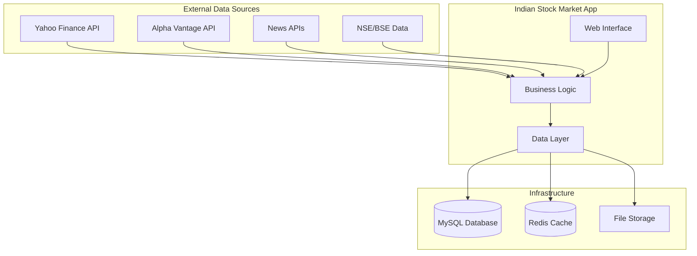
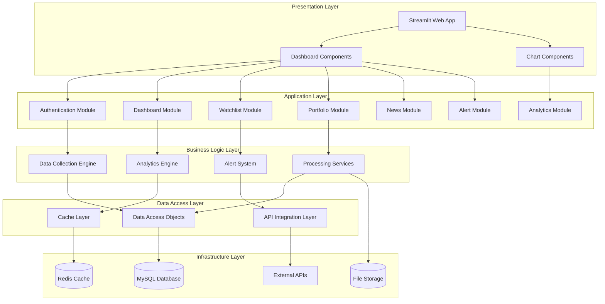
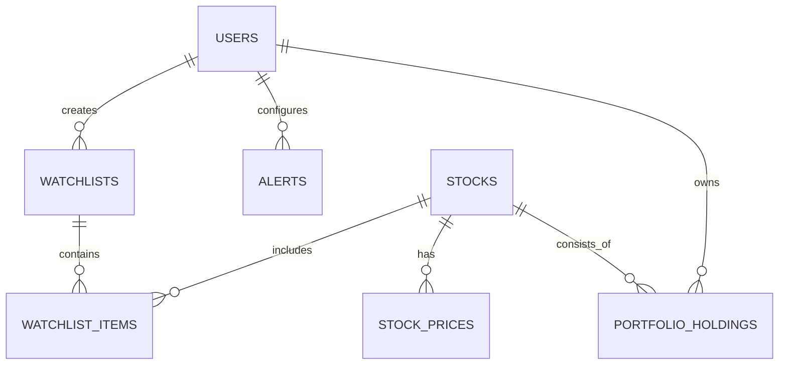

# System Requirements Specification (SRS)
## Indian Stock Market Analytics Application

---

### Document Information
| **Attribute** | **Details** |
|---------------|-------------|
| **Document Title** | System Requirements Specification - Indian Stock Market Analytics Application |
| **Version** | 1.0 |
| **Date** | December 2024 |
| **Project Code** | ISMA-2024 |
| **Document Type** | Technical Specification |
| **Status** | Draft for Review |

---

## Table of Contents
1. [Introduction](#1-introduction)
2. [System Overview](#2-system-overview)
3. [System Architecture](#3-system-architecture)
4. [Functional Requirements](#4-functional-requirements)
5. [Non-Functional Requirements](#5-non-functional-requirements)
6. [Technical Requirements](#6-technical-requirements)
7. [Data Requirements](#7-data-requirements)
8. [Integration Requirements](#8-integration-requirements)
9. [Security Requirements](#9-security-requirements)
10. [Performance Requirements](#10-performance-requirements)
11. [Deployment Requirements](#11-deployment-requirements)
12. [Testing Requirements](#12-testing-requirements)

---

## 1. Introduction

### 1.1 Purpose
This System Requirements Specification (SRS) document defines the technical requirements, system architecture, and implementation specifications for the Indian Stock Market Analytics Application. It serves as a comprehensive guide for development, testing, and deployment teams.

### 1.2 Scope
The application provides comprehensive stock market analysis capabilities for Indian equity markets, including real-time data processing, technical analysis, portfolio management, and intelligent alerting systems.

### 1.3 Document Conventions
- **Must Have**: Critical requirements for system functionality
- **Should Have**: Important requirements that enhance user experience
- **Could Have**: Nice-to-have features for future releases

### 1.4 References
- Business Requirements Document (BRD) v1.0
- Functional Modules Document v1.0
- Technical Architecture Guidelines
- Indian Stock Market Data Standards

---

## 2. System Overview

### 2.1 System Purpose
The Indian Stock Market Analytics Application is designed to:
- Provide real-time market data and analytics for Indian equity markets
- Enable sophisticated technical and fundamental analysis
- Support portfolio tracking and performance monitoring
- Deliver intelligent alerts and market insights
- Facilitate data-driven investment decisions

### 2.2 Target Users
- **Retail Investors**: Individual investors seeking market insights
- **Technical Analysts**: Professionals requiring advanced charting tools
- **Portfolio Managers**: Investment professionals managing multiple portfolios
- **Financial Advisors**: Professionals providing investment guidance

### 2.3 System Context


---

## 3. System Architecture

### 3.1 High-Level Architecture



### 3.2 Technology Stack

| **Layer** | **Technology** | **Version** | **Purpose** |
|-----------|---------------|-------------|-------------|
| **Frontend** | Streamlit | 1.28+ | Web application framework |
| **Backend** | Python | 3.8+ | Core application logic |
| **Database** | MySQL | 8.0+ | Primary data storage |
| **Cache** | Redis | 6.2+ | Performance optimization |
| **Visualization** | Plotly | 5.15+ | Interactive charts |
| **Data Processing** | Pandas | 1.5+ | Data manipulation |
| **Task Queue** | Celery | 5.2+ | Background job processing |
| **API Integration** | Requests | 2.28+ | External API communication |

### 3.3 System Components

#### 3.3.1 Core Modules
- **Market Dashboard Module**: Real-time market overview and status
- **Data Collection Module**: Automated data gathering and processing
- **Analytics Engine**: Technical analysis and performance calculations
- **Watchlist Management**: Stock monitoring and organization
- **Portfolio Tracking**: Investment portfolio management
- **Alert System**: Intelligent notification engine
- **News Module**: Market news aggregation and sentiment analysis
- **Charting Module**: Interactive visualization components

#### 3.3.2 Supporting Components
- **Authentication Module**: User management and security
- **Configuration Manager**: System settings and parameters
- **Logging System**: Application monitoring and debugging
- **Error Handler**: Exception management and recovery
- **Scheduler**: Automated task execution
- **API Manager**: External service integration

---

## 4. Functional Requirements

### 4.1 Market Data Management (FR-4.1)

#### 4.1.1 Real-Time Data Processing
```python
class MarketDataRequirements:
    """
    Real-time market data processing requirements
    """
    DATA_UPDATE_FREQUENCY = 5  # seconds
    SUPPORTED_STOCKS = 1000+   # Indian equity stocks
    DATA_DELAY_TOLERANCE = 5   # seconds
    TRADING_HOURS = "09:15-15:30 IST"
```

**Requirements:**
- **FR-4.1.1**: Process real-time stock price updates within 5-second intervals
- **FR-4.1.2**: Support 1000+ Indian equity stocks simultaneously
- **FR-4.1.3**: Display major indices (NIFTY 50, SENSEX, Bank NIFTY) in real-time
- **FR-4.1.4**: Provide volume and turnover data with market depth information
- **FR-4.1.5**: Show market status with session timers and holiday calendar

#### 4.1.2 Historical Data Management
**Requirements:**
- **FR-4.1.6**: Store minimum 5 years of OHLCV historical data
- **FR-4.1.7**: Support multiple timeframes (1min, 5min, 15min, 1hour, 1day, 1week)
- **FR-4.1.8**: Handle corporate actions (stock splits, bonuses, dividends)
- **FR-4.1.9**: Provide data export functionality (CSV, Excel formats)
- **FR-4.1.10**: Implement data validation and quality checks

### 4.2 Analytics Engine (FR-4.2)

#### 4.2.1 Technical Analysis
**Requirements:**
- **FR-4.2.1**: Calculate 20+ technical indicators (SMA, EMA, RSI, MACD, Bollinger Bands, Stochastic, Williams %R, etc.)
- **FR-4.2.2**: Support customizable indicator parameters and periods
- **FR-4.2.3**: Provide indicator crossover detection and alerts
- **FR-4.2.4**: Generate support and resistance levels automatically
- **FR-4.2.5**: Implement pattern recognition algorithms

#### 4.2.2 Performance Analytics
**Requirements:**
- **FR-4.2.6**: Calculate daily, weekly, monthly, and yearly returns
- **FR-4.2.7**: Compute volatility metrics and risk-adjusted returns
- **FR-4.2.8**: Provide correlation analysis between stocks and indices
- **FR-4.2.9**: Generate sector-wise performance comparisons
- **FR-4.2.10**: Calculate beta and alpha metrics against benchmarks

### 4.3 Portfolio Management (FR-4.3)

#### 4.3.1 Watchlist Functionality
**Requirements:**
- **FR-4.3.1**: Create and manage unlimited custom watchlists
- **FR-4.3.2**: Support drag-and-drop stock organization
- **FR-4.3.3**: Provide watchlist performance tracking and analytics
- **FR-4.3.4**: Enable watchlist sharing and collaboration features
- **FR-4.3.5**: Support watchlist import/export capabilities

#### 4.3.2 Portfolio Tracking
**Requirements:**
- **FR-4.3.6**: Track multiple portfolios with transaction history
- **FR-4.3.7**: Calculate real-time portfolio valuation and P&L
- **FR-4.3.8**: Provide portfolio diversification analysis
- **FR-4.3.9**: Generate performance attribution reports
- **FR-4.3.10**: Support tax calculation and reporting features

### 4.4 Alert and Notification System (FR-4.4)

**Requirements:**
- **FR-4.4.1**: Configure price-based alerts (target, stop-loss, percentage change)
- **FR-4.4.2**: Set volume and market cap-based alerts
- **FR-4.4.3**: Provide technical indicator crossover notifications
- **FR-4.4.4**: Support multiple notification channels (email, in-app, push)
- **FR-4.4.5**: Implement intelligent alert management to prevent spam

### 4.5 News and Market Intelligence (FR-4.5)

**Requirements:**
- **FR-4.5.1**: Aggregate news from multiple financial sources
- **FR-4.5.2**: Filter news by stock, sector, and market segments
- **FR-4.5.3**: Provide sentiment analysis for market news
- **FR-4.5.4**: Implement news search and archival functionality
- **FR-4.5.5**: Correlate news events with price movements

---

## 5. Non-Functional Requirements

### 5.1 Performance Requirements (NFR-5.1)

| **Requirement ID** | **Metric** | **Target** | **Priority** |
|-------------------|------------|------------|--------------|
| NFR-5.1.1 | Page Load Time | ≤ 2 seconds | Must Have |
| NFR-5.1.2 | Data Refresh Rate | ≤ 5 seconds | Must Have |
| NFR-5.1.3 | Chart Rendering | ≤ 3 seconds | Must Have |
| NFR-5.1.4 | Database Query Response | ≤ 5 seconds | Must Have |
| NFR-5.1.5 | Concurrent User Support | 100+ simultaneous users | Should Have |

### 5.2 Scalability Requirements (NFR-5.2)

| **Requirement ID** | **Metric** | **Target** | **Priority** |
|-------------------|------------|------------|--------------|
| NFR-5.2.1 | Stock Universe Coverage | 1000+ Indian stocks | Must Have |
| NFR-5.2.2 | Historical Data Storage | 5+ years | Must Have |
| NFR-5.2.3 | User Base Support | 10,000+ registered users | Should Have |
| NFR-5.2.4 | Data Volume Handling | 1TB+ historical data | Should Have |

### 5.3 Reliability Requirements (NFR-5.3)

| **Requirement ID** | **Metric** | **Target** | **Priority** |
|-------------------|------------|------------|--------------|
| NFR-5.3.1 | System Uptime | 99.5% overall | Must Have |
| NFR-5.3.2 | Market Hours Uptime | 99.9% (9:15-15:30 IST) | Must Have |
| NFR-5.3.3 | Data Accuracy | 99.9% vs official sources | Must Have |
| NFR-5.3.4 | Mean Time to Recovery | ≤ 5 minutes | Should Have |

### 5.4 Usability Requirements (NFR-5.4)

| **Requirement ID** | **Metric** | **Target** | **Priority** |
|-------------------|------------|------------|--------------|
| NFR-5.4.1 | Mobile Responsiveness | 100% responsive design | Must Have |
| NFR-5.4.2 | Browser Compatibility | Chrome, Firefox, Safari, Edge | Must Have |
| NFR-5.4.3 | Task Completion Rate | 90% for core features | Must Have |
| NFR-5.4.4 | User Learning Curve | ≤ 30 minutes for basic features | Should Have |

---

## 6. Technical Requirements

### 6.1 Development Environment

#### 6.1.1 Programming Languages and Frameworks
```yaml
Programming Languages:
  - Python: 3.8+
  - JavaScript: ES6+
  - SQL: MySQL 8.0+
  - HTML5/CSS3

Frameworks and Libraries:
  - Streamlit: 1.28+
  - Pandas: 1.5+
  - NumPy: 1.21+
  - Plotly: 5.15+
  - SQLAlchemy: 1.4+
  - Redis-py: 4.3+
  - Requests: 2.28+
  - APScheduler: 3.9+
```

#### 6.1.2 Database Requirements
```sql
-- Database Schema Requirements
DATABASE_ENGINE: MySQL 8.0+
CHARACTER_SET: utf8mb4
COLLATION: utf8mb4_unicode_ci
STORAGE_ENGINE: InnoDB
MAX_CONNECTIONS: 1000
QUERY_CACHE_SIZE: 256MB
INNODB_BUFFER_POOL_SIZE: 2GB
```

#### 6.1.3 Caching Layer
```yaml
Redis Configuration:
  Version: 6.2+
  Memory: 4GB+
  Persistence: RDB + AOF
  Max Memory Policy: allkeys-lru
  TTL Strategy: Configurable per data type
```

### 6.2 API Integration Specifications

#### 6.2.1 External Data Sources
```python
class APISpecifications:
    """
    External API integration requirements
    """
    YAHOO_FINANCE = {
        "base_url": "https://query1.finance.yahoo.com/v8/finance/chart/",
        "rate_limit": "2000 requests/hour",
        "response_format": "JSON",
        "timeout": 10,
        "retry_attempts": 3
    }
    
    ALPHA_VANTAGE = {
        "base_url": "https://www.alphavantage.co/query",
        "rate_limit": "500 requests/day",
        "response_format": "JSON",
        "timeout": 15,
        "retry_attempts": 2
    }
```

#### 6.2.2 Data Processing Pipeline
```python
class DataPipeline:
    """
    Data processing pipeline specifications
    """
    BATCH_SIZE = 100  # stocks per batch
    PROCESSING_INTERVAL = 300  # seconds
    ERROR_THRESHOLD = 0.1  # 10% error tolerance
    VALIDATION_RULES = [
        "price_range_validation",
        "volume_validation", 
        "timestamp_validation",
        "data_completeness_check"
    ]
```

### 6.3 System Architecture Patterns

#### 6.3.1 Design Patterns
- **Repository Pattern**: Data access abstraction
- **Factory Pattern**: Component creation
- **Observer Pattern**: Event handling and notifications
- **Strategy Pattern**: Algorithm selection for analysis
- **Singleton Pattern**: Configuration and connection management

#### 6.3.2 Microservices Architecture
```yaml
Services:
  - data-collection-service
  - analytics-service
  - notification-service
  - user-management-service
  - portfolio-service
  
Communication:
  - REST APIs for synchronous communication
  - Message queues for asynchronous processing
  - WebSockets for real-time data streaming
```

---

## 7. Data Requirements

### 7.1 Data Model Specifications

#### 7.1.1 Core Entities
```sql
-- Stock Master Data
CREATE TABLE stocks (
    symbol VARCHAR(20) PRIMARY KEY,
    company_name VARCHAR(255) NOT NULL,
    sector VARCHAR(100),
    market_cap DECIMAL(15,2),
    listing_date DATE,
    is_active BOOLEAN DEFAULT TRUE,
    created_at TIMESTAMP DEFAULT CURRENT_TIMESTAMP,
    updated_at TIMESTAMP DEFAULT CURRENT_TIMESTAMP ON UPDATE CURRENT_TIMESTAMP
);

-- Historical Price Data
CREATE TABLE stock_prices (
    id BIGINT PRIMARY KEY AUTO_INCREMENT,
    symbol VARCHAR(20) NOT NULL,
    date DATE NOT NULL,
    timeframe ENUM('1min', '5min', '15min', '1hour', '1day') NOT NULL,
    open_price DECIMAL(10,2) NOT NULL,
    high_price DECIMAL(10,2) NOT NULL,
    low_price DECIMAL(10,2) NOT NULL,
    close_price DECIMAL(10,2) NOT NULL,
    volume BIGINT NOT NULL,
    turnover DECIMAL(15,2),
    created_at TIMESTAMP DEFAULT CURRENT_TIMESTAMP,
    UNIQUE KEY uk_symbol_date_timeframe (symbol, date, timeframe),
    FOREIGN KEY (symbol) REFERENCES stocks(symbol)
);

-- User Management
CREATE TABLE users (
    user_id INT PRIMARY KEY AUTO_INCREMENT,
    username VARCHAR(50) UNIQUE NOT NULL,
    email VARCHAR(255) UNIQUE NOT NULL,
    password_hash VARCHAR(255) NOT NULL,
    is_active BOOLEAN DEFAULT TRUE,
    created_at TIMESTAMP DEFAULT CURRENT_TIMESTAMP,
    last_login TIMESTAMP,
    preferences JSON
);

-- Watchlists
CREATE TABLE watchlists (
    watchlist_id INT PRIMARY KEY AUTO_INCREMENT,
    user_id INT NOT NULL,
    name VARCHAR(100) NOT NULL,
    description TEXT,
    is_default BOOLEAN DEFAULT FALSE,
    created_at TIMESTAMP DEFAULT CURRENT_TIMESTAMP,
    FOREIGN KEY (user_id) REFERENCES users(user_id)
);

-- Portfolio Holdings
CREATE TABLE portfolio_holdings (
    holding_id INT PRIMARY KEY AUTO_INCREMENT,
    user_id INT NOT NULL,
    symbol VARCHAR(20) NOT NULL,
    quantity INT NOT NULL,
    avg_price DECIMAL(10,2) NOT NULL,
    purchase_date DATE NOT NULL,
    created_at TIMESTAMP DEFAULT CURRENT_TIMESTAMP,
    FOREIGN KEY (user_id) REFERENCES users(user_id),
    FOREIGN KEY (symbol) REFERENCES stocks(symbol)
);
```

### 7.2 Data Storage Requirements

#### 7.2.1 Storage Specifications
| **Data Type** | **Volume** | **Retention** | **Storage Medium** |
|---------------|------------|---------------|--------------------|
| Real-time Prices | 10GB/month | 5 years | MySQL + Redis |
| Historical Data | 500GB | Permanent | MySQL |
| User Data | 100MB/1000 users | User lifecycle | MySQL |
| News Articles | 50GB/year | 2 years | File System |
| Chart Images | 10GB | 30 days | File System |

#### 7.2.2 Data Backup Strategy
```yaml
Backup Strategy:
  Full Backup: Weekly (Sunday 2 AM IST)
  Incremental Backup: Daily (2 AM IST)
  Transaction Log Backup: Every 15 minutes
  Retention Period: 90 days
  Storage Location: AWS S3 / Local NAS
  Recovery Time Objective (RTO): 4 hours
  Recovery Point Objective (RPO): 15 minutes
```

---

## 8. Integration Requirements

### 8.1 External System Integration

#### 8.1.1 Data Provider APIs
```python
class ExternalIntegrations:
    """
    External system integration specifications
    """
    YAHOO_FINANCE = {
        "endpoint": "/v8/finance/chart/{symbol}",
        "authentication": None,
        "rate_limit": "2000/hour",
        "data_format": "JSON",
        "supported_timeframes": ["1m", "5m", "15m", "1h", "1d"]
    }
    
    ALPHA_VANTAGE = {
        "endpoint": "/query",
        "authentication": "API_KEY",
        "rate_limit": "500/day", 
        "data_format": "JSON",
        "functions": ["TIME_SERIES_DAILY", "TECHNICAL_INDICATORS"]
    }
    
    NEWS_APIS = {
        "newsapi": {
            "endpoint": "/v2/everything",
            "authentication": "API_KEY",
            "rate_limit": "1000/day"
        }
    }
```

#### 8.1.2 Integration Patterns
- **Circuit Breaker Pattern**: Handle API failures gracefully
- **Retry Mechanism**: Exponential backoff for failed requests
- **Fallback Strategy**: Secondary data sources for redundancy
- **Rate Limiting**: Respect API provider limits

### 8.2 Internal System Integration

#### 8.2.1 Service Communication
```yaml
Internal APIs:
  - User Service API: /api/v1/users/*
  - Portfolio Service API: /api/v1/portfolios/*
  - Analytics Service API: /api/v1/analytics/*
  - Alert Service API: /api/v1/alerts/*
  
Authentication: JWT tokens
Data Format: JSON
Error Handling: Standardized error responses
Logging: Centralized logging system
```

---

## 9. Security Requirements

### 9.1 Authentication and Authorization

#### 9.1.1 User Authentication
```python
class SecurityRequirements:
    """
    Security implementation requirements
    """
    PASSWORD_POLICY = {
        "min_length": 8,
        "require_uppercase": True,
        "require_lowercase": True,
        "require_numbers": True,
        "require_special_chars": True,
        "password_expiry": "90 days"
    }
    
    SESSION_MANAGEMENT = {
        "session_timeout": "2 hours",
        "token_type": "JWT",
        "refresh_token_validity": "7 days",
        "max_concurrent_sessions": 3
    }
```

#### 9.1.2 Data Protection
- **Encryption at Rest**: AES-256 encryption for sensitive data
- **Encryption in Transit**: TLS 1.3 for all communications
- **API Key Management**: Secure vault for external API keys
- **Database Security**: Encrypted connections, access controls

### 9.2 Security Monitoring

#### 9.2.1 Audit Logging
```sql
-- Security Audit Log
CREATE TABLE security_audit_log (
    log_id BIGINT PRIMARY KEY AUTO_INCREMENT,
    user_id INT,
    action VARCHAR(100) NOT NULL,
    resource VARCHAR(255),
    ip_address VARCHAR(45),
    user_agent TEXT,
    timestamp TIMESTAMP DEFAULT CURRENT_TIMESTAMP,
    status ENUM('SUCCESS', 'FAILED', 'BLOCKED'),
    details JSON
);
```

---

## 10. Performance Requirements

### 10.1 System Performance Specifications

#### 10.1.1 Response Time Requirements
```yaml
Performance Targets:
  Page Load Time:
    - Dashboard: < 2 seconds
    - Charts: < 3 seconds  
    - Watchlists: < 1.5 seconds
    - Portfolio: < 2 seconds
  
  API Response Time:
    - Real-time data: < 1 second
    - Historical data: < 3 seconds
    - Analytics calculations: < 5 seconds
  
  Database Query Performance:
    - Simple queries: < 100ms
    - Complex analytics: < 2 seconds
    - Bulk operations: < 10 seconds
```

#### 10.1.2 Throughput Requirements
- **Concurrent Users**: 100+ simultaneous users
- **API Requests**: 1000+ requests per minute
- **Data Processing**: 10,000+ stock price updates per minute
- **Chart Rendering**: 50+ charts per minute

### 10.2 Scalability Architecture

#### 10.2.1 Horizontal Scaling
```yaml
Scaling Strategy:
  Web Tier: Load balancer + Multiple Streamlit instances
  Application Tier: Microservices with container orchestration
  Database Tier: Read replicas + Partitioning
  Cache Tier: Redis cluster with sharding
```

#### 10.2.2 Performance Optimization
- **Database Indexing**: Optimized indexes for frequently queried data
- **Caching Strategy**: Multi-layer caching (Redis, Application, Browser)
- **Lazy Loading**: On-demand data loading for charts and analytics
- **Connection Pooling**: Database connection optimization

---

## 11. Deployment Requirements

### 11.1 Infrastructure Requirements

#### 11.1.1 Server Specifications
```yaml
Production Environment:
  Web Server:
    - CPU: 4 cores, 3.0GHz+
    - RAM: 8GB+
    - Storage: 100GB SSD
    - Network: 1Gbps
  
  Database Server:
    - CPU: 8 cores, 3.0GHz+
    - RAM: 16GB+
    - Storage: 1TB SSD (RAID 10)
    - Network: 1Gbps
  
  Cache Server:
    - CPU: 4 cores, 3.0GHz+
    - RAM: 8GB+
    - Storage: 50GB SSD
    - Network: 1Gbps
```

#### 11.1.2 Software Environment
```yaml
Operating System: Ubuntu 22.04 LTS
Web Server: Nginx 1.20+
Application Server: Gunicorn/uWSGI
Process Manager: Supervisor
Container Platform: Docker + Docker Compose
Monitoring: Prometheus + Grafana
Logging: ELK Stack (Elasticsearch, Logstash, Kibana)
```

### 11.2 Deployment Strategy

#### 11.2.1 CI/CD Pipeline
```yaml
Source Control: Git (GitHub/GitLab)
Build Tool: GitHub Actions / GitLab CI
Testing: pytest, unittest
Code Quality: SonarQube, Black, Flake8
Deployment: Blue-Green deployment strategy
Environment Management: Staging → Production
```

#### 11.2.2 Configuration Management
```python
class DeploymentConfig:
    """
    Environment-specific configuration management
    """
    ENVIRONMENTS = ["development", "testing", "staging", "production"]
    
    CONFIG_SOURCES = [
        "environment_variables",
        "config_files", 
        "secrets_manager",
        "database_config"
    ]
    
    DEPLOYMENT_CHECKLIST = [
        "database_migration",
        "static_files_deployment",
        "cache_warming",
        "health_checks",
        "monitoring_setup"
    ]
```

---

## 12. Testing Requirements

### 12.1 Testing Strategy

#### 12.1.1 Test Types and Coverage
```yaml
Unit Testing:
  - Framework: pytest
  - Coverage Target: 80%+
  - Scope: Individual functions and methods
  
Integration Testing:
  - Framework: pytest + requests
  - Coverage: API endpoints, database operations
  - Scope: Component interactions
  
End-to-End Testing:
  - Framework: Selenium WebDriver
  - Coverage: Critical user workflows
  - Scope: Complete user journeys
  
Performance Testing:
  - Framework: locust
  - Load Testing: 100+ concurrent users
  - Stress Testing: System breaking point
```

#### 12.1.2 Test Data Management
```python
class TestDataRequirements:
    """
    Test data management specifications
    """
    SAMPLE_STOCKS = ["RELIANCE.NS", "TCS.NS", "HDFCBANK.NS", "INFY.NS"]
    HISTORICAL_DATA_PERIOD = "1 year"
    TEST_USER_ACCOUNTS = 10
    MOCK_API_RESPONSES = True
    DATA_REFRESH_FREQUENCY = "Daily"
```

### 12.2 Quality Assurance

#### 12.2.1 Code Quality Standards
```yaml
Code Quality Tools:
  - Linting: flake8, pylint
  - Formatting: black, isort
  - Type Checking: mypy
  - Security: bandit
  - Documentation: sphinx
  
Quality Gates:
  - Code Coverage: 80%+
  - Cyclomatic Complexity: < 10
  - Duplicate Code: < 5%
  - Security Vulnerabilities: 0 high/critical
```

#### 12.2.2 Testing Environment
```yaml
Test Environment Specifications:
  - Isolated test database
  - Mock external API responses
  - Containerized test environment
  - Automated test execution
  - Test result reporting
```

---

## Appendices

### A. Technology Compatibility Matrix

| **Component** | **Version** | **Compatibility** | **Dependencies** |
|---------------|-------------|-------------------|-------------------|
| Python | 3.8+ | Full | Core runtime |
| Streamlit | 1.28+ | Full | Web framework |
| MySQL | 8.0+ | Full | Primary database |
| Redis | 6.2+ | Full | Caching layer |
| Pandas | 1.5+ | Full | Data processing |
| Plotly | 5.15+ | Full | Visualization |

### B. API Endpoint Specifications

```yaml
Core API Endpoints:
  - GET /api/v1/stocks/{symbol}/price
  - GET /api/v1/stocks/{symbol}/history
  - POST /api/v1/watchlists
  - GET /api/v1/portfolios/{id}/performance
  - POST /api/v1/alerts
  - GET /api/v1/news/latest
```

### C. Database Schema Diagram



### D. Monitoring and Alerting

```yaml
System Monitoring:
  Metrics:
    - System resources (CPU, Memory, Disk)
    - Application performance (Response time, Throughput)
    - Database performance (Query time, Connections)
    - External API health (Response time, Error rate)
  
  Alerts:
    - High resource utilization (>80%)
    - Slow response times (>5 seconds)
    - API failures (>5% error rate)
    - Database connection issues
```

---

**Document Version**: 1.0  
**Last Updated**: December 2024  
**Next Review**: January 2025

---

## 13. Error Handling and Recovery

### 13.1 Error Classification

#### 13.1.1 System Errors
```python
class SystemErrorHandling:
    """
    System-level error handling specifications
    """
    ERROR_CATEGORIES = {
        "CRITICAL": {
            "examples": ["Database connection failure", "API service down"],
            "response_time": "< 5 minutes",
            "escalation": "Immediate notification to admin"
        },
        "HIGH": {
            "examples": ["Data sync failure", "Chart rendering error"],
            "response_time": "< 15 minutes", 
            "escalation": "Notification to support team"
        },
        "MEDIUM": {
            "examples": ["Individual stock data missing", "News feed delay"],
            "response_time": "< 1 hour",
            "escalation": "Log for review"
        },
        "LOW": {
            "examples": ["UI display glitches", "Minor calculation errors"],
            "response_time": "< 4 hours",
            "escalation": "Batch processing in next cycle"
        }
    }
```

#### 13.1.2 Application Recovery Procedures
```yaml
Recovery Procedures:
  Database Failure:
    - Automatic failover to read replica
    - Graceful degradation to cached data
    - User notification of limited functionality
    - Background recovery process initiation
  
  API Service Failure:
    - Switch to backup data provider
    - Cached data utilization
    - Retry mechanism with exponential backoff
    - Service health monitoring
  
  Application Crash:
    - Automatic process restart
    - Session state recovery
    - User data preservation
    - Error logging and reporting
```

### 13.2 Data Consistency and Integrity

#### 13.2.1 Data Validation Rules
```sql
-- Data integrity constraints
ALTER TABLE stock_prices 
ADD CONSTRAINT chk_price_positive 
CHECK (open_price > 0 AND high_price > 0 AND low_price > 0 AND close_price > 0);

ALTER TABLE stock_prices 
ADD CONSTRAINT chk_high_low_relationship 
CHECK (high_price >= low_price AND high_price >= open_price AND high_price >= close_price);

ALTER TABLE portfolio_holdings 
ADD CONSTRAINT chk_quantity_positive 
CHECK (quantity > 0 AND avg_price > 0);
```

#### 13.2.2 Data Synchronization
```python
class DataSynchronization:
    """
    Data synchronization and consistency requirements
    """
    SYNC_STRATEGIES = {
        "real_time_data": {
            "method": "WebSocket streaming",
            "fallback": "Polling every 5 seconds",
            "consistency": "Eventually consistent"
        },
        "historical_data": {
            "method": "Batch processing",
            "schedule": "Daily at 6 PM IST",
            "consistency": "Strong consistency"
        },
        "user_data": {
            "method": "Immediate synchronization",
            "backup": "Every 15 minutes",
            "consistency": "Strong consistency"
        }
    }
```

---

## 14. Monitoring and Observability

### 14.1 Application Monitoring

#### 14.1.1 Key Performance Indicators (KPIs)
```yaml
Technical KPIs:
  System Performance:
    - Response Time: P95 < 2 seconds
    - Throughput: > 1000 requests/minute
    - Error Rate: < 0.1%
    - Uptime: > 99.5%
  
  Data Quality:
    - Data Accuracy: > 99.9%
    - Data Freshness: < 5 seconds delay
    - Data Completeness: > 99%
    - API Success Rate: > 99%
  
  User Experience:
    - Page Load Time: < 2 seconds
    - Chart Render Time: < 3 seconds
    - Search Response: < 1 second
    - Alert Delivery: < 30 seconds
```

#### 14.1.2 Monitoring Stack
```yaml
Monitoring Tools:
  Infrastructure Monitoring:
    - Tool: Prometheus + Node Exporter
    - Metrics: CPU, Memory, Disk, Network
    - Alerts: Resource thresholds exceeded
  
  Application Monitoring:
    - Tool: Prometheus + Custom metrics
    - Metrics: Request rate, response time, error rate
    - Dashboards: Grafana visualizations
  
  Log Management:
    - Tool: ELK Stack (Elasticsearch, Logstash, Kibana)
    - Log Levels: DEBUG, INFO, WARN, ERROR, CRITICAL
    - Retention: 90 days for analysis
  
  Real User Monitoring:
    - Tool: Custom analytics integration
    - Metrics: User interactions, feature usage
    - Privacy: GDPR compliant data collection
```

### 14.2 Health Checks and Diagnostics

#### 14.2.1 Health Check Endpoints
```python
class HealthChecks:
    """
    Health check endpoint specifications
    """
    ENDPOINTS = {
        "/health": {
            "purpose": "Basic application health",
            "response_time": "< 100ms",
            "checks": ["application_status", "basic_connectivity"]
        },
        "/health/detailed": {
            "purpose": "Comprehensive system health",
            "response_time": "< 500ms", 
            "checks": [
                "database_connectivity",
                "external_api_status",
                "cache_availability",
                "disk_space",
                "memory_usage"
            ]
        },
        "/metrics": {
            "purpose": "Prometheus metrics endpoint",
            "format": "Prometheus exposition format",
            "security": "Internal network only"
        }
    }
```

#### 14.2.2 Diagnostic Tools
```yaml
Diagnostic Capabilities:
  Database Diagnostics:
    - Query performance analysis
    - Connection pool monitoring
    - Index usage statistics
    - Slow query identification
  
  API Diagnostics:
    - External API response times
    - Rate limit monitoring
    - Error rate tracking
    - Payload size analysis
  
  User Experience Diagnostics:
    - Page load waterfall analysis
    - JavaScript error tracking
    - Browser compatibility issues
    - Mobile performance metrics
```

---

## 15. Backup and Disaster Recovery

### 15.1 Backup Strategy

#### 15.1.1 Backup Requirements
```yaml
Backup Specifications:
  Database Backup:
    Full Backup:
      - Frequency: Weekly (Sunday 2:00 AM IST)
      - Retention: 12 weeks
      - Storage: AWS S3 + Local NAS
      - Encryption: AES-256
    
    Incremental Backup:
      - Frequency: Daily (2:00 AM IST)
      - Retention: 30 days
      - Storage: AWS S3
      - Compression: gzip
    
    Transaction Log Backup:
      - Frequency: Every 15 minutes
      - Retention: 7 days
      - Storage: Local + AWS S3
  
  Application Backup:
    Configuration Files:
      - Frequency: On change + Daily
      - Version Control: Git repository
      - Storage: Multiple repositories
    
    User Uploaded Data:
      - Frequency: Real-time sync
      - Storage: AWS S3 with versioning
      - Retention: User account lifetime
```

#### 15.1.2 Backup Validation
```python
class BackupValidation:
    """
    Backup validation and testing procedures
    """
    VALIDATION_PROCEDURES = {
        "integrity_check": {
            "frequency": "Daily",
            "method": "Checksum verification",
            "alert_on_failure": True
        },
        "restore_test": {
            "frequency": "Monthly",
            "environment": "Isolated test environment",
            "validation_criteria": [
                "Data completeness",
                "Application functionality",
                "Performance benchmarks"
            ]
        },
        "recovery_drill": {
            "frequency": "Quarterly",
            "scope": "Full system recovery",
            "participants": ["DevOps", "Database", "Application teams"]
        }
    }
```

### 15.2 Disaster Recovery Plan

#### 15.2.1 Recovery Objectives
```yaml
Recovery Targets:
  Recovery Time Objective (RTO):
    - Critical Systems: 4 hours
    - Non-Critical Systems: 24 hours
    - Data Recovery: 2 hours
  
  Recovery Point Objective (RPO):
    - Transactional Data: 15 minutes
    - Configuration Data: 1 hour
    - Static Content: 24 hours
  
  Business Continuity:
    - Market Hours Operation: 99.9% availability
    - User Data Integrity: 100% preservation
    - Service Degradation: Graceful fallback modes
```

#### 15.2.2 Recovery Procedures
```yaml
Disaster Recovery Steps:
  Immediate Response (0-1 hour):
    - Incident assessment and classification
    - Stakeholder notification
    - Emergency response team activation
    - Initial damage assessment
  
  Short-term Recovery (1-4 hours):
    - Infrastructure provisioning
    - Database restoration
    - Application deployment
    - Basic functionality verification
  
  Full Recovery (4-24 hours):
    - Complete system restoration
    - Data synchronization
    - Performance optimization
    - User access restoration
  
  Post-Recovery (24+ hours):
    - System monitoring and validation
    - Performance tuning
    - Incident documentation
    - Process improvement planning
```

---

## 16. Compliance and Regulatory Requirements

### 16.1 Data Privacy Compliance

#### 16.1.1 GDPR Compliance
```yaml
GDPR Requirements:
  Data Collection:
    - Explicit consent for data processing
    - Clear privacy policy and terms
    - Purpose limitation principle
    - Data minimization approach
  
  User Rights:
    - Right to access personal data
    - Right to rectification
    - Right to erasure (right to be forgotten)
    - Right to data portability
    - Right to object to processing
  
  Technical Measures:
    - Data encryption at rest and in transit
    - Pseudonymization of personal data
    - Regular security assessments
    - Data breach notification procedures
```

#### 16.1.2 Indian IT Act Compliance
```python
class ComplianceRequirements:
    """
    Indian IT Act 2000 compliance specifications
    """
    DATA_PROTECTION_MEASURES = {
        "personal_data_security": {
            "encryption_standard": "AES-256",
            "access_controls": "Role-based access",
            "audit_logging": "All data access logged",
            "data_retention": "As per legal requirements"
        },
        "sensitive_personal_data": {
            "categories": [
                "Financial information",
                "Biometric data",
                "Medical records"
            ],
            "special_protection": "Enhanced encryption and access controls",
            "consent_requirements": "Explicit written consent"
        }
    }
```

### 16.2 Financial Regulations

#### 16.2.1 SEBI Guidelines Compliance
```yaml
SEBI Compliance:
  Data Accuracy:
    - Stock prices must match official exchanges
    - Corporate actions reflected accurately
    - Regulatory announcements displayed
    - Disclaimer about investment advice
  
  User Protection:
    - Clear risk warnings
    - Educational content about investments
    - No guaranteed returns promises
    - Transparent fee structure
  
  Record Keeping:
    - User activity logs
    - Transaction records
    - System access logs
    - Regulatory reporting capabilities
```

---

## 17. Maintenance and Support

### 17.1 System Maintenance

#### 17.1.1 Maintenance Schedule
```yaml
Maintenance Windows:
  Regular Maintenance:
    - Schedule: Sunday 1:00 AM - 4:00 AM IST
    - Frequency: Weekly
    - Activities:
      - System updates and patches
      - Database maintenance
      - Performance optimization
      - Security updates
  
  Emergency Maintenance:
    - Trigger: Critical security issues or system failures
    - Duration: As required
    - Notification: 2 hours advance notice (when possible)
    - Approval: Change management board
  
  Planned Upgrades:
    - Schedule: Quarterly
    - Duration: 8 hours maximum
    - Notification: 1 week advance notice
    - Rollback Plan: Complete rollback capability
```

#### 17.1.2 Maintenance Procedures
```python
class MaintenanceActivities:
    """
    System maintenance activity specifications
    """
    DATABASE_MAINTENANCE = [
        "Index reorganization and optimization",
        "Statistics update for query optimization", 
        "Data archival and cleanup",
        "Backup validation and testing",
        "Performance monitoring review"
    ]
    
    APPLICATION_MAINTENANCE = [
        "Security patch installation",
        "Dependency updates",
        "Configuration optimization",
        "Log file rotation and cleanup",
        "Cache optimization"
    ]
    
    INFRASTRUCTURE_MAINTENANCE = [
        "Server resource monitoring",
        "Network connectivity checks",
        "Storage capacity planning",
        "Security scan execution",
        "Monitoring system validation"
    ]
```

### 17.2 Support Framework

#### 17.2.1 Support Levels
```yaml
Support Tiers:
  Level 1 - Basic Support:
    - User account issues
    - Basic functionality questions
    - Password resets
    - General navigation help
    - Response Time: 4 hours
  
  Level 2 - Technical Support:
    - Data synchronization issues
    - Feature-specific problems
    - Performance concerns
    - Integration issues
    - Response Time: 2 hours
  
  Level 3 - Expert Support:
    - Complex technical issues
    - System architecture problems
    - Security incidents
    - Data corruption issues
    - Response Time: 1 hour
```

#### 17.2.2 Support Documentation
```yaml
Documentation Requirements:
  User Documentation:
    - User manual with screenshots
    - Feature guides and tutorials
    - FAQ section
    - Video tutorials
    - Mobile app guide
  
  Technical Documentation:
    - API documentation
    - Database schema documentation
    - Deployment guides
    - Troubleshooting manuals
    - Architecture diagrams
  
  Operational Documentation:
    - Runbook procedures
    - Incident response guides
    - Maintenance checklists
    - Recovery procedures
    - Configuration management
```

---

## 18. Future Enhancements

### 18.1 Planned Features

#### 18.1.1 Phase 2 Enhancements
```yaml
Advanced Analytics:
  Machine Learning Models:
    - Price prediction algorithms
    - Market sentiment analysis
    - Pattern recognition systems
    - Risk assessment models
  
  Advanced Portfolio Features:
    - Portfolio optimization
    - Risk-adjusted returns
    - Asset allocation recommendations
    - Tax optimization strategies
  
  Social Trading Features:
    - Community watchlists
    - Trading ideas sharing
    - Expert recommendations
    - Social sentiment indicators
```

#### 18.1.2 Technology Upgrades
```yaml
Infrastructure Improvements:
  Cloud Migration:
    - AWS/Azure deployment
    - Containerized architecture
    - Microservices implementation
    - Auto-scaling capabilities
  
  Performance Enhancements:
    - Real-time streaming data
    - Advanced caching strategies
    - CDN integration
    - Mobile application development
  
  AI Integration:
    - Natural language processing
    - Automated report generation
    - Intelligent alerting
    - Chatbot support system
```

### 18.2 Scalability Roadmap

#### 18.2.1 Growth Planning
```yaml
Scalability Milestones:
  Year 1:
    - 10,000 registered users
    - 100 concurrent users
    - 1,000 stocks coverage
    - Basic analytics features
  
  Year 2:
    - 50,000 registered users
    - 500 concurrent users
    - Full NSE/BSE coverage
    - Advanced analytics
  
  Year 3:
    - 100,000+ registered users
    - 1,000+ concurrent users
    - Multi-asset class support
    - AI-powered features
```

---

## 19. Glossary

### 19.1 Technical Terms

| **Term** | **Definition** |
|----------|----------------|
| **API Rate Limiting** | Restriction on the number of API calls allowed per time period |
| **OHLCV Data** | Open, High, Low, Close, Volume price data format |
| **WebSocket** | Communication protocol for real-time bidirectional data transfer |
| **JWT Token** | JSON Web Token for secure authentication and authorization |
| **Circuit Breaker** | Design pattern to prevent cascading failures in distributed systems |
| **Blue-Green Deployment** | Deployment strategy using two identical production environments |

### 19.2 Financial Terms

| **Term** | **Definition** |
|----------|----------------|
| **NIFTY 50** | Stock market index of 50 major Indian companies |
| **SENSEX** | Stock market index of 30 major Indian companies |
| **Market Cap** | Total market value of a company's outstanding shares |
| **RSI** | Relative Strength Index - momentum oscillator indicator |
| **MACD** | Moving Average Convergence Divergence - trend-following indicator |
| **Beta** | Measure of stock's volatility relative to the overall market |

### 19.3 Business Terms

| **Term** | **Definition** |
|----------|----------------|
| **RTO** | Recovery Time Objective - target time to restore service after outage |
| **RPO** | Recovery Point Objective - maximum acceptable data loss duration |
| **SLA** | Service Level Agreement - commitment to service quality metrics |
| **KPI** | Key Performance Indicator - measurable business success metrics |
| **GDPR** | General Data Protection Regulation - EU data privacy law |
| **SEBI** | Securities and Exchange Board of India - market regulator |

---

## 20. Document Control

### 20.1 Version History

| **Version** | **Date** | **Author** | **Changes** |
|-------------|----------|------------|-------------|
| 0.1 | Dec 2024 | Technical Team | Initial draft creation |
| 0.2 | Dec 2024 | Business Analyst | Requirements refinement |
| 0.3 | Dec 2024 | Architect | Technical specifications added |
| 1.0 | Dec 2024 | Project Manager | Final review and approval |

### 20.2 Approval Matrix

| **Role** | **Name** | **Approval Date** | **Signature** |
|----------|----------|-------------------|---------------|
| **Technical Architect** | [Name] | [Date] | [Digital Signature] |
| **Product Owner** | [Name] | [Date] | [Digital Signature] |
| **Development Manager** | [Name] | [Date] | [Digital Signature] |
| **Quality Assurance Lead** | [Name] | [Date] | [Digital Signature] |

### 20.3 Distribution List

| **Stakeholder** | **Role** | **Document Access** |
|-----------------|----------|-------------------|
| Development Team | Implementation | Full access |
| QA Team | Testing | Full access |
| DevOps Team | Deployment | Full access |
| Business Analysts | Requirements | Read access |
| Project Managers | Coordination | Full access |

---

**Document Classification**: Internal Use  
**Security Level**: Confidential  
**Document Owner**: Technical Architecture Team  
**Next Review Date**: March 2025  
**Document Location**: Project Repository - /docs/technical/SRS.md

---

*This document is proprietary and confidential. Distribution is restricted to authorized project stakeholders only.*