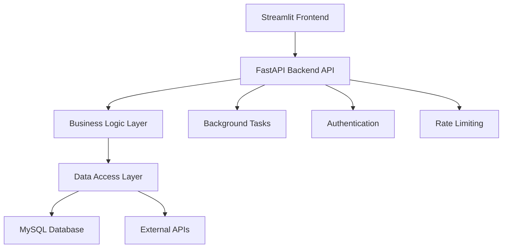

# Updated Stock Market Application - Project Structure with FastAPI

## 🔄 Architecture Overview

The updated architecture separates the application into distinct layers:
- **Frontend**: Streamlit UI components
- **API Layer**: FastAPI backend for internal API calls
- **Data Layer**: Database operations and external API integrations



## 📁 Updated Project Structure

```
stock_market_app/
├── README.md
├── requirements.txt
├── requirements-dev.txt
├── .env.example
├── .gitignore
├── docker-compose.yml
├── Dockerfile.api
├── Dockerfile.streamlit
│
├── app.py                          # Main Streamlit application entry point
├── api_main.py                     # FastAPI application entry point
│
├── config/                         # Configuration files
│   ├── __init__.py
│   ├── settings.py                 # Application settings
│   ├── database_config.py          # Database configuration
│   ├── api_config.py              # API-specific configuration
│   └── logging_config.py          # Logging configuration
│
├── api/                           # FastAPI backend layer
│   ├── __init__.py
│   ├── main.py                    # FastAPI app initialization
│   ├── dependencies.py           # Common dependencies
│   ├── middleware.py             # Custom middleware
│   │
│   ├── routers/                  # API route modules
│   │   ├── __init__.py
│   │   ├── stocks.py            # Stock-related endpoints
│   │   ├── market.py            # Market analysis endpoints
│   │   ├── watchlist.py         # Watchlist management endpoints
│   │   ├── news.py              # News and research endpoints
│   │   ├── analytics.py         # Analytics and reports endpoints
│   │   └── health.py            # Health check endpoints
│   │
│   ├── schemas/                  # Pydantic models for API
│   │   ├── __init__.py
│   │   ├── stock.py             # Stock-related schemas
│   │   ├── market.py            # Market analysis schemas
│   │   ├── watchlist.py         # Watchlist schemas
│   │   ├── news.py              # News schemas
│   │   ├── analytics.py         # Analytics schemas
│   │   ├── common.py            # Common schemas
│   │   └── responses.py         # Response models
│   │
│   ├── services/                 # Business logic layer
│   │   ├── __init__.py
│   │   ├── stock_service.py     # Stock business logic
│   │   ├── market_service.py    # Market analysis logic
│   │   ├── watchlist_service.py # Watchlist operations
│   │   ├── news_service.py      # News processing logic
│   │   ├── analytics_service.py # Analytics calculations
│   │   └── cache_service.py     # Caching logic
│   │
│   ├── core/                     # Core API functionality
│   │   ├── __init__.py
│   │   ├── auth.py              # Authentication logic
│   │   ├── exceptions.py        # Custom exception handlers
│   │   ├── rate_limiter.py      # Rate limiting implementation
│   │   ├── security.py          # Security utilities
│   │   └── validators.py        # Custom validators
│   │
│   └── tasks/                    # Background tasks
│       ├── __init__.py
│       ├── celery_app.py        # Celery configuration
│       ├── data_updater.py      # Scheduled data updates
│       ├── indicator_calculator.py # Technical indicators
│       └── notification_sender.py # Alert notifications
│
├── data/                         # Data layer (existing, updated)
│   ├── __init__.py
│   ├── database.py              # Database models and connections
│   ├── repositories/            # Repository pattern implementation
│   │   ├── __init__.py
│   │   ├── base_repository.py   # Base repository class
│   │   ├── stock_repository.py  # Stock data repository
│   │   ├── market_repository.py # Market data repository
│   │   └── watchlist_repository.py # Watchlist repository
│   ├── api_client.py            # External API integrations
│   └── data_processor.py        # Data processing and calculations
│
├── frontend/                     # Streamlit components (reorganized)
│   ├── __init__.py
│   ├── client/                  # API client for Streamlit
│   │   ├── __init__.py
│   │   ├── api_client.py        # FastAPI client wrapper
│   │   ├── auth_client.py       # Authentication client
│   │   └── websocket_client.py  # Real-time updates client
│   │
│   ├── pages/                   # Streamlit pages (existing)
│   │   ├── __init__.py
│   │   ├── dashboard.py         # Main dashboard page
│   │   ├── analytics.py         # Analytics and reports
│   │   ├── watchlist.py         # Watchlist management
│   │   ├── charts.py           # Advanced charting page
│   │   └── news.py             # News and research page
│   │
│   ├── components/              # Reusable Streamlit components
│   │   ├── __init__.py
│   │   ├── charts.py           # Chart components
│   │   ├── tables.py           # Table components
│   │   ├── metrics.py          # Metric display components
│   │   ├── forms.py            # Form components
│   │   └── navigation.py       # Navigation components
│   │
│   └── utils/                   # Frontend utilities
│       ├── __init__.py
│       ├── session_manager.py  # Session state management
│       ├── cache_manager.py    # Frontend caching
│       └── formatters.py       # Data formatting utilities
│
├── utils/                       # Shared utilities (existing, updated)
│   ├── __init__.py
│   ├── charts.py               # Chart generation utilities
│   ├── calculations.py         # Technical indicator calculations
│   ├── helpers.py              # Common helper functions
│   ├── constants.py            # Application constants
│   ├── logging.py              # Logging utilities
│   └── monitoring.py           # Application monitoring
│
├── tests/                      # Test files (expanded)
│   ├── __init__.py
│   ├── conftest.py             # Pytest configuration
│   ├── api/                    # API tests
│   │   ├── __init__.py
│   │   ├── test_stocks.py      # Stock endpoint tests
│   │   ├── test_market.py      # Market endpoint tests
│   │   ├── test_watchlist.py   # Watchlist endpoint tests
│   │   └── test_auth.py        # Authentication tests
│   ├── services/               # Service layer tests
│   │   ├── __init__.py
│   │   ├── test_stock_service.py
│   │   ├── test_market_service.py
│   │   └── test_watchlist_service.py
│   ├── data/                   # Data layer tests
│   │   ├── __init__.py
│   │   ├── test_repositories.py
│   │   └── test_database.py
│   └── frontend/               # Frontend tests
│       ├── __init__.py
│       └── test_components.py
│
├── migrations/                 # Database migrations
│   ├── __init__.py
│   ├── versions/
│   └── alembic.ini
│
├── scripts/                    # Utility scripts (existing, updated)
│   ├── __init__.py
│   ├── data_migration.py       # Database migration scripts
│   ├── initial_setup.py        # Initial data setup
│   ├── backup_restore.py       # Database backup utilities
│   ├── start_services.py       # Service startup script
│   └── deployment.py           # Deployment helpers
│
├── assets/                     # Static assets (existing)
│   ├── css/
│   │   └── custom.css          # Custom styling
│   └── images/
│       └── logo.png            # Application logo
│
├── docs/                       # Documentation
│   ├── api/                    # API documentation
│   │   ├── endpoints.md        # Endpoint documentation
│   │   └── schemas.md          # Schema documentation
│   ├── deployment.md           # Deployment guide
│   └── development.md          # Development guide
│
└── monitoring/                 # Monitoring and observability
    ├── __init__.py
    ├── metrics.py              # Application metrics
    ├── health_checks.py        # Health check implementations
    └── alerts.py               # Alert configurations
```

## 🔧 Key Changes Made

### 1. **Separated API Layer**
- Added `api/` directory with FastAPI implementation
- Organized API routes by functionality (`routers/`)
- Implemented service layer for business logic (`services/`)
- Added proper schema definitions (`schemas/`)

### 2. **Enhanced Data Layer**
- Introduced repository pattern in `data/repositories/`
- Better separation of concerns between database operations and business logic

### 3. **Reorganized Frontend**
- Moved Streamlit-specific code to `frontend/` directory
- Added API client for communication with FastAPI backend
- Created reusable component library

### 4. **Improved Configuration**
- Separate configuration for API and Streamlit applications
- Environment-specific settings management

### 5. **Enhanced Testing Structure**
- Comprehensive test coverage for all layers
- Separate test directories for API, services, and frontend

### 6. **Added Monitoring and Observability**
- Application metrics and health checks
- Structured logging configuration
- Alert management system

## 🚀 Benefits of This Structure

1. **Separation of Concerns**: Clear distinction between presentation, business logic, and data layers
2. **Scalability**: Easy to scale API and frontend independently
3. **Testing**: Comprehensive test coverage across all layers
4. **Maintainability**: Organized code structure for easier maintenance
5. **Deployment Flexibility**: Can deploy components separately or together
6. **Performance**: Optimized API layer with proper caching and rate limiting

## 🔄 Migration Path

1. **Phase 1**: Set up FastAPI backend structure
2. **Phase 2**: Implement core API endpoints
3. **Phase 3**: Update Streamlit frontend to use API client
4. **Phase 4**: Add authentication and rate limiting
5. **Phase 5**: Implement background tasks and monitoring

This structure provides a solid foundation for a production-ready stock market analytics platform with clear separation of concerns and excellent scalability potential.